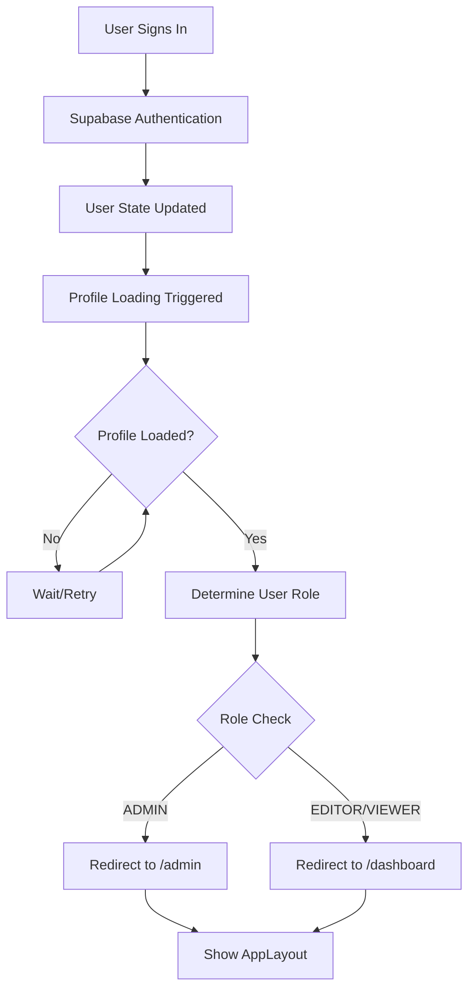
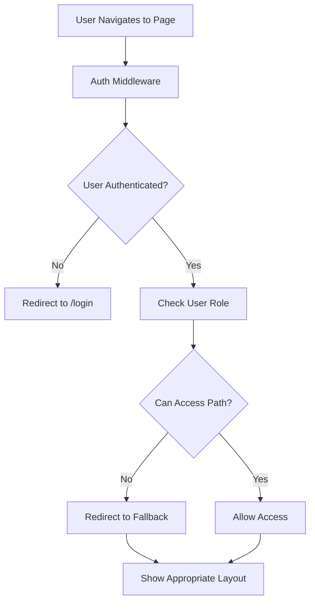

# Redirect Handling Implementation

## Overview

This document describes the centralized redirect handling system implemented in the Optiqo Dashboard application. The system provides role-based navigation that ensures users are redirected to the appropriate dashboard based on their role after authentication.

## Problem Statement

The initial implementation had several issues with user redirects after authentication:

- **Inconsistent redirect destinations**: Different parts of the code redirected users to different pages
- **Race conditions**: Redirects happened before user profiles were fully loaded
- **Layout conflicts**: Dashboard layout was shown on public pages like login
- **Missing role support**: VIEWER role wasn't supported in TypeScript interfaces
- **No centralized logic**: Redirect logic was scattered across multiple files

## Solution Architecture

### Core Components

1. **Centralized Redirect Utility** (`server/utils/redirectUtils.ts`)
2. **Enhanced useAuth Composable** (`composables/useAuth.ts`)
3. **Updated App Layout Logic** (`app.vue`)
4. **Role-Based Middleware** (`middleware/auth.ts`)
5. **Updated Page Components** (login, signup, auth callback, etc.)

### Redirect Rules

| User Role | Redirect Destination | Description |
|-----------|---------------------|-------------|
| `ADMIN`   | `/admin`            | Admin dashboard for organization management |
| `EDITOR`  | `/dashboard`        | User dashboard for content creation |
| `VIEWER`  | `/dashboard`        | User dashboard for viewing content |

## Implementation Details

### 1. Centralized Redirect Utility

**File**: `server/utils/redirectUtils.ts`

The utility provides centralized functions for role-based redirects:

```typescript
export type UserRole = 'ADMIN' | 'EDITOR' | 'VIEWER'

export interface UserProfile {
  id: string
  email: string
  firstName: string
  lastName: string
  organizationId: string | null
  role: UserRole
  organization?: any
  avatar_url?: string | null
  created_at: string
}

/**
 * Get the appropriate redirect path based on user role
 */
export function getRedirectPathByRole(role: UserRole): string

/**
 * Get redirect path from user profile
 */
export function getRedirectPathFromProfile(userProfile: UserProfile | null): string | null

/**
 * Check if a user can access a specific path based on their role
 */
export function canAccessPath(role: UserRole, path: string): boolean

/**
 * Get the appropriate fallback path if user cannot access requested path
 */
export function getFallbackPath(role: UserRole, requestedPath: string): string
```

**Key Features:**
- Type-safe role definitions
- Centralized redirect logic
- Access control validation
- Fallback path handling

### 2. Enhanced useAuth Composable

**File**: `composables/useAuth.ts`

The composable now includes centralized redirect functionality:

```typescript
// Centralized redirect function based on user role
const getRedirectPath = () => {
  return getRedirectPathFromProfile(userProfile.value)
}

// Navigate to appropriate dashboard based on user role
const redirectToDashboard = async (retryCount = 0) => {
  // Wait for profile to load if not already loaded
  if (!userProfile.value && user.value) {
    console.log('🔄 Waiting for user profile to load... (attempt', retryCount + 1, ')')
    await loadUserProfile()
  }
  
  const redirectPath = getRedirectPath()
  if (redirectPath) {
    console.log('🔄 Redirecting to:', redirectPath)
    await navigateTo(redirectPath)
  } else if (retryCount < 3) {
    // Retry a few times if profile is not loaded yet
    console.log('⚠️ Profile not loaded yet, retrying in 500ms...')
    await new Promise(resolve => setTimeout(resolve, 500))
    return redirectToDashboard(retryCount + 1)
  } else {
    console.warn('⚠️ No redirect path available after retries, user profile:', userProfile.value)
    // Fallback to login if no profile after retries
    await navigateTo('/login')
  }
}
```

**Key Features:**
- Automatic profile loading before redirect
- Retry mechanism for race conditions
- Comprehensive error handling
- Detailed logging for debugging

### 3. Updated App Layout Logic

**File**: `app.vue`

The app layout now properly handles public vs authenticated pages:

```vue
<template>
  <div>
    <!-- Color Scheme for theme management -->
    <ColorScheme />
    
    <!-- Authenticated layout -->
    <AppLayout v-if="isAuthenticated && !isPublicPage">
      <NuxtPage />
    </AppLayout>
    
    <!-- Public pages (login, signup) -->
    <NuxtPage v-else />
  </div>
</template>

<script setup>
// Authentication state - using Supabase's built-in reactive user state
const user = useSupabaseUser()
const { isAuthenticated } = useAuth()
const route = useRoute()

// Check if current page is a public page that shouldn't show AppLayout
const isPublicPage = computed(() => {
  const publicRoutes = ['/login', '/signup', '/forgot-password', '/reset-password', '/auth/callback']
  return publicRoutes.some(publicRoute => publicRoute === route.path)
})
</script>
```

**Key Features:**
- Prevents dashboard layout on public pages
- Proper conditional rendering
- Public route detection

### 4. Role-Based Middleware

**File**: `middleware/auth.ts`

The middleware now uses centralized access control:

```typescript
export default defineNuxtRouteMiddleware(async (to, from) => {
  // ... authentication validation ...
  
  // Import redirect utilities
  const { canAccessPath, getFallbackPath } = await import('~/server/utils/redirectUtils')
  
  // Check if user can access the requested path
  if (!canAccessPath(profile.role, to.path)) {
    console.log('🛡️ Auth middleware: User cannot access path, redirecting to fallback')
    const fallbackPath = getFallbackPath(profile.role, to.path)
    return navigateTo(fallbackPath)
  }
  
  // User exists in database and can access path - allow access
  return
})
```

**Key Features:**
- Centralized access control
- Automatic fallback redirects
- Role-based path validation

### 5. Updated Page Components

All authentication-related pages now use centralized redirect logic:

#### Login Page (`pages/login.vue`)
```typescript
// Redirect if already authenticated
const { isAuthenticated, redirectToDashboard } = useAuth()

// Use nextTick to ensure the auth state is properly initialized
await nextTick()

if (isAuthenticated.value) {
  console.log('🔄 User already authenticated, redirecting...')
  await redirectToDashboard()
}

// Handle form submission
const handleSignIn = async () => {
  try {
    const result = await signIn(form.value.email, form.value.password)
    
    if (result.success) {
      // Wait for user profile to load to check role
      const { redirectToDashboard } = useAuth()
      
      // Give a small delay to ensure profile loading completes
      await new Promise(resolve => setTimeout(resolve, 500))
      
      // Use centralized redirect logic
      await redirectToDashboard()
    }
  } catch (err) {
    console.error('❌ Login page: Sign in error:', err)
  }
}
```

#### Auth Callback (`pages/auth/callback.vue`)
```typescript
// Redirect to dashboard based on user role
const redirectToDashboard = async () => {
  const { redirectToDashboard: authRedirectToDashboard } = useAuth()
  await authRedirectToDashboard()
}
```

## Authentication Flow

### 1. User Authentication Process



### 2. Page Access Control



## Security Considerations

### 1. Access Control
- **Role-based path validation**: Users can only access paths appropriate to their role
- **Automatic fallback redirects**: Unauthorized access attempts are redirected to appropriate dashboards
- **Middleware protection**: All protected routes are validated through middleware

### 2. Profile Validation
- **Database verification**: User profiles are validated against the database
- **Session validation**: Authentication state is verified on each request
- **Automatic cleanup**: Invalid sessions are cleared automatically

### 3. Error Handling
- **Graceful degradation**: System continues to work even if profile loading fails
- **Retry mechanisms**: Automatic retries for transient failures
- **Fallback redirects**: Safe fallbacks when redirect logic fails

## Testing Scenarios

### Manual Testing Checklist

#### Authentication Flow
- [ ] **ADMIN users** → Redirected to `/admin` after login
- [ ] **EDITOR users** → Redirected to `/dashboard` after login
- [ ] **VIEWER users** → Redirected to `/dashboard` after login
- [ ] **Already authenticated users** → Properly redirected from login page
- [ ] **Profile loading delays** → Handled with retry mechanism

#### Access Control
- [ ] **Non-ADMIN users accessing `/admin`** → Redirected to their dashboard
- [ ] **Invalid sessions** → Redirected to login page
- [ ] **Database errors** → Handled gracefully with fallbacks

#### Layout Rendering
- [ ] **Public pages** → No dashboard layout shown
- [ ] **Authenticated pages** → Proper AppLayout displayed
- [ ] **Page transitions** → Smooth navigation between pages

#### Error Scenarios
- [ ] **Network failures** → Retry mechanism works correctly
- [ ] **Profile loading failures** → Fallback redirects work
- [ ] **Invalid user data** → Error handling works properly

### Automated Testing

```typescript
// Example test cases for redirect logic
describe('Redirect Handling', () => {
  test('ADMIN users redirect to /admin', () => {
    const profile = { role: 'ADMIN' }
    expect(getRedirectPathFromProfile(profile)).toBe('/admin')
  })
  
  test('EDITOR users redirect to /dashboard', () => {
    const profile = { role: 'EDITOR' }
    expect(getRedirectPathFromProfile(profile)).toBe('/dashboard')
  })
  
  test('VIEWER users redirect to /dashboard', () => {
    const profile = { role: 'VIEWER' }
    expect(getRedirectPathFromProfile(profile)).toBe('/dashboard')
  })
  
  test('Non-ADMIN users cannot access /admin', () => {
    expect(canAccessPath('EDITOR', '/admin')).toBe(false)
    expect(canAccessPath('VIEWER', '/admin')).toBe(false)
  })
  
  test('ADMIN users can access all paths', () => {
    expect(canAccessPath('ADMIN', '/admin')).toBe(true)
    expect(canAccessPath('ADMIN', '/dashboard')).toBe(true)
  })
})
```

## Configuration

### Environment Variables

No additional environment variables are required for the redirect system. It uses existing Supabase configuration.

### Database Requirements

The system requires the following database structure:

```sql
-- Profiles table with role constraint
CREATE TABLE profiles (
  user_id UUID REFERENCES auth.users(id) PRIMARY KEY,
  first_name TEXT,
  last_name TEXT,
  role TEXT CHECK (role IN ('ADMIN', 'EDITOR', 'VIEWER')) NOT NULL,
  organization_id UUID REFERENCES organizations(id) ON DELETE SET NULL,
  created_at TIMESTAMP WITH TIME ZONE DEFAULT NOW() NOT NULL
);
```

## Troubleshooting

### Common Issues

#### 1. Users Stuck on Login Page
**Symptoms**: Users see login page with dashboard layout
**Cause**: Profile not loaded before redirect
**Solution**: Check console logs for profile loading errors, verify database connection

#### 2. Wrong Redirect Destination
**Symptoms**: Users redirected to incorrect page
**Cause**: Profile role not properly set in database
**Solution**: Verify user profile in database, check role field

#### 3. Layout Conflicts
**Symptoms**: Dashboard layout shown on public pages
**Cause**: Public route detection not working
**Solution**: Check `isPublicPage` computed property in `app.vue`

#### 4. Infinite Redirect Loops
**Symptoms**: Page keeps redirecting without stopping
**Cause**: Fallback redirect logic creating loops
**Solution**: Check redirect path logic, verify profile loading

### Debug Tools

#### Console Logging
The system provides detailed console logging:
- `🔄` - Redirect operations
- `⚠️` - Warnings and retries
- `❌` - Errors and failures
- `✅` - Successful operations

#### Browser DevTools
- **Network tab**: Check for failed API calls
- **Console**: Look for redirect-related logs
- **Application tab**: Check Supabase session state

#### Database Queries
```sql
-- Check user profile
SELECT * FROM profiles WHERE user_id = 'user-id-here';

-- Check role distribution
SELECT role, COUNT(*) FROM profiles GROUP BY role;

-- Check for missing profiles
SELECT auth.users.id, auth.users.email 
FROM auth.users 
LEFT JOIN profiles ON auth.users.id = profiles.user_id 
WHERE profiles.user_id IS NULL;
```

## Performance Considerations

### 1. Profile Loading
- **Caching**: User profiles are cached in the composable
- **Lazy loading**: Profiles are only loaded when needed
- **Retry limits**: Maximum 3 retries to prevent infinite loops

### 2. Redirect Operations
- **Single source of truth**: Centralized logic reduces code duplication
- **Efficient path checking**: Simple string comparisons for path validation
- **Minimal database queries**: Profile data is cached after first load

### 3. Layout Rendering
- **Conditional rendering**: Only renders appropriate layout components
- **Computed properties**: Efficient reactive updates
- **Route-based logic**: Minimal computation for public page detection

## Future Enhancements

### Potential Improvements

1. **Advanced Role Permissions**
   - Granular permissions within roles
   - Dynamic permission loading
   - Role hierarchy support

2. **Enhanced Redirect Logic**
   - Remember intended destination
   - Smart redirect after login
   - Custom redirect rules per organization

3. **Performance Optimizations**
   - Profile preloading
   - Redirect caching
   - Lazy route loading

4. **Analytics Integration**
   - Redirect tracking
   - User flow analytics
   - Performance monitoring

### Migration Path

When adding new roles or changing redirect logic:

1. **Update TypeScript interfaces** in `redirectUtils.ts`
2. **Add new role mappings** in `getRedirectPathByRole()`
3. **Update access control** in `canAccessPath()`
4. **Test all scenarios** with new roles
5. **Update documentation** to reflect changes

## Conclusion

The centralized redirect handling system provides a robust, maintainable solution for role-based navigation in the Optiqo Dashboard application. By centralizing the logic and implementing proper error handling, the system ensures users are always directed to the appropriate dashboard based on their role while maintaining security and performance.

The implementation follows Vue 3 Composition API best practices and integrates seamlessly with the existing Nuxt/Supabase architecture. The modular design allows for easy extension and maintenance as the application grows.
