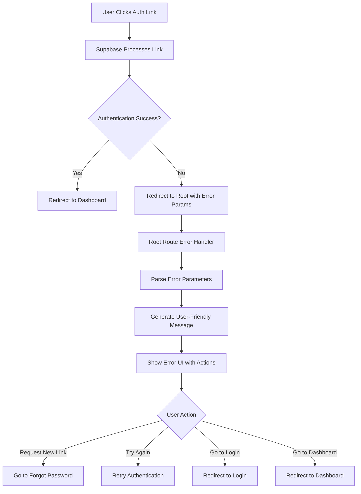

# Authentication Error Handling Implementation

## Overview

This document describes the implementation of comprehensive authentication error handling for the Optiqo Dashboard application. The system handles Supabase authentication errors that are redirected to the root URL with error parameters, providing users with clear error messages and appropriate recovery actions.

## Problem Statement

The initial implementation had a critical issue with authentication error handling:

- **Supabase authentication errors** (expired magic links, invalid tokens, etc.) were redirected to the root URL (`/`) with error parameters
- **The root route immediately redirected** unauthenticated users to `/login` without processing error information
- **Users saw no feedback** about what went wrong with their authentication attempt
- **Error details were lost** in the automatic redirect, leading to poor user experience
- **No recovery actions** were provided for different types of authentication errors

### Example Error URL
```
http://localhost:3000/?error=access_denied&error_code=otp_expired&error_description=Email+link+is+invalid+or+has+expired
```

## Solution Architecture

### Core Components

1. **Root Route Error Handler** (`pages/index.vue`)
2. **Error Parameter Parser** (handles Supabase error query parameters)
3. **User-Friendly Error Messages** (converts technical errors to readable messages)
4. **Context-Aware Action Buttons** (provides appropriate recovery actions)
5. **Error State Management** (reactive UI states for different error scenarios)

### Error Handling Flow



## Implementation Details

### 1. Error Parameter Detection

The system detects Supabase error parameters in the URL query string:

```javascript
const handleAuthErrors = () => {
  if (!process.client) return false

  // Check for error parameters in the URL
  const errorParam = route.query.error
  const errorCode = route.query.error_code
  const errorDescription = route.query.error_description

  if (errorParam) {
    // Process error and show UI
    return true
  }
  return false
}
```

### 2. Error Message Mapping

Technical Supabase errors are mapped to user-friendly messages:

| Error Code | Error Parameter | User Message |
|------------|----------------|--------------|
| `otp_expired` | `access_denied` | "This password reset link has expired. Please request a new one." |
| `otp_expired` | (other) | "This magic link has expired. Please request a new one." |
| `invalid_request` | (any) | "The magic link is invalid. Please request a new one." |
| `access_denied` | (any) | "Access was denied. The magic link may have expired or been used already." |
| `server_error` | (any) | "A server error occurred. Please try again later." |

### 3. Context-Aware UI Actions

The error UI provides different action buttons based on the error type:

```javascript
const isMagicLinkError = computed(() => {
  if (!error.value) return false
  const errorText = error.value.toLowerCase()
  return errorText.includes('magic link') || 
         errorText.includes('password reset') ||
         errorText.includes('expired') || 
         errorText.includes('invalid') ||
         errorText.includes('access denied')
})
```

**Action Buttons:**
- **Magic Link/Password Reset Errors**: "Request New Reset Link" or "Request New Magic Link"
- **Other Errors**: "Try Again"
- **Always Available**: "Go to Login"

### 4. State Management

The component uses reactive state to manage different UI states:

```javascript
// State
const loading = ref(true)
const error = ref('')
const success = ref(false)
const loadingMessage = ref('Redirecting...')
const loadingDescription = ref('Taking you to your dashboard')
```

## File Structure

```
pages/
├── index.vue                 # Root route with error handling
├── auth/
│   └── callback.vue          # Auth callback (successful auth)
├── login.vue                 # Login page
└── forgot-password.vue       # Password reset page
```

## Code Implementation

### Root Route Handler (`pages/index.vue`)

```vue
<template>
  <div class="min-h-screen flex items-center justify-center py-12 px-4 sm:px-6 lg:px-8">
    <div class="max-w-md w-full space-y-8">
      <!-- Loading state -->
      <div v-if="loading" class="text-center">
        <div class="mx-auto h-12 w-12 flex items-center justify-center">
          <Icon name="heroicons:arrow-path" class="animate-spin h-8 w-8 text-primary" />
        </div>
        <h2 class="mt-6 text-3xl font-heading font-bold text-gray-900 dark:text-white">
          {{ loadingMessage }}
        </h2>
        <p class="mt-2 text-sm text-gray-600 dark:text-gray-400">
          {{ loadingDescription }}
        </p>
      </div>

      <!-- Error state -->
      <div v-else-if="error" class="text-center">
        <div class="mx-auto flex items-center justify-center h-12 w-12 rounded-full bg-red-100">
          <Icon name="heroicons:x-mark" class="h-6 w-6 text-red-600" />
        </div>
        <h2 class="mt-6 text-3xl font-heading font-bold text-gray-900 dark:text-white">
          Authentication Error
        </h2>
        <p class="mt-2 text-sm text-gray-600 dark:text-gray-400">
          {{ error }}
        </p>
        
        <!-- Action buttons based on error type -->
        <div class="mt-6 flex gap-3">
          <UButton 
            v-if="isMagicLinkError" 
            @click="goToForgotPassword" 
            class="flex-1"
            style="background-color: #F28C28;"
          >
            {{ error.includes('password reset') ? 'Request New Reset Link' : 'Request New Magic Link' }}
          </UButton>
          <UButton 
            v-else 
            variant="outline" 
            @click="retry" 
            class="flex-1"
          >
            Try Again
          </UButton>
          <UButton 
            @click="goToLogin" 
            variant="outline" 
            class="flex-1"
          >
            Go to Login
          </UButton>
        </div>
      </div>

      <!-- Success state (shouldn't normally show here) -->
      <div v-else-if="success" class="text-center">
        <div class="mx-auto flex items-center justify-center h-12 w-12 rounded-full bg-green-100">
          <Icon name="heroicons:check" class="h-6 w-6 text-green-600" />
        </div>
        <h2 class="mt-6 text-3xl font-heading font-bold text-gray-900 dark:text-white">
          {{ successMessage }}
        </h2>
        <p class="mt-2 text-sm text-gray-600 dark:text-gray-400">
          {{ successDescription }}
        </p>
        <UButton @click="goToDashboard" class="mt-6 w-full justify-center">
          Continue to Dashboard
        </UButton>
      </div>
    </div>
  </div>
</template>
```

### Error Processing Logic

```javascript
// Handle authentication errors from Supabase
const handleAuthErrors = () => {
  if (!process.client) return false

  // Check for error parameters in the URL
  const errorParam = route.query.error
  const errorCode = route.query.error_code
  const errorDescription = route.query.error_description

  if (errorParam) {
    let userFriendlyMessage = errorDescription || errorParam

    // Handle specific error codes and combinations
    if (errorCode === 'otp_expired') {
      if (errorParam === 'access_denied') {
        userFriendlyMessage = 'This password reset link has expired. Please request a new one.'
      } else {
        userFriendlyMessage = 'This magic link has expired. Please request a new one.'
      }
    } else if (errorCode === 'invalid_request') {
      userFriendlyMessage = 'The magic link is invalid. Please request a new one.'
    } else if (errorParam === 'access_denied') {
      userFriendlyMessage = 'Access was denied. The magic link may have expired or been used already.'
    } else if (errorParam === 'server_error') {
      userFriendlyMessage = 'A server error occurred. Please try again later.'
    }

    // Set error state
    error.value = userFriendlyMessage
    loading.value = false
    return true
  }

  return false
}
```

### Action Handlers

```javascript
// Action handlers
const goToLogin = async () => {
  await navigateTo('/login')
}

const goToForgotPassword = async () => {
  await navigateTo('/forgot-password')
}

const goToDashboard = async () => {
  await navigateTo('/dashboard')
}

const retry = async () => {
  // Clear error and try again
  error.value = ''
  loading.value = true
  loadingMessage.value = 'Redirecting...'
  loadingDescription.value = 'Taking you to your dashboard'
  
  // Wait a moment then check auth state again
  await new Promise(resolve => setTimeout(resolve, 1000))
  
  if (isAuthenticated.value) {
    await navigateTo('/dashboard')
  } else {
    await navigateTo('/login')
  }
}
```

## Error Scenarios Handled

### 1. Expired Password Reset Links
- **URL**: `/?error=access_denied&error_code=otp_expired&error_description=Email+link+is+invalid+or+has+expired`
- **Message**: "This password reset link has expired. Please request a new one."
- **Actions**: "Request New Reset Link", "Go to Login"

### 2. Expired Magic Links
- **URL**: `/?error=otp_expired&error_description=Magic+link+has+expired`
- **Message**: "This magic link has expired. Please request a new one."
- **Actions**: "Request New Magic Link", "Go to Login"

### 3. Invalid Magic Links
- **URL**: `/?error=invalid_request&error_description=Invalid+magic+link`
- **Message**: "The magic link is invalid. Please request a new one."
- **Actions**: "Request New Magic Link", "Go to Login"

### 4. Access Denied
- **URL**: `/?error=access_denied&error_description=Access+denied`
- **Message**: "Access was denied. The magic link may have expired or been used already."
- **Actions**: "Try Again", "Go to Login"

### 5. Server Errors
- **URL**: `/?error=server_error&error_description=Internal+server+error`
- **Message**: "A server error occurred. Please try again later."
- **Actions**: "Try Again", "Go to Login"

## Benefits

### 1. **Improved User Experience**
- Clear, actionable error messages instead of generic redirects
- Context-appropriate recovery actions
- No loss of error information

### 2. **Better Error Recovery**
- Users can easily request new authentication links
- Retry functionality for transient errors
- Clear path back to login for manual authentication

### 3. **Reduced Support Burden**
- Self-service error recovery
- Clear error explanations reduce confusion
- Appropriate next steps for each error type

### 4. **Developer Experience**
- Centralized error handling logic
- Easy to extend for new error types
- Consistent error UI patterns

## Testing

### Manual Testing Scenarios

1. **Test Expired Password Reset Link**
   - Request password reset
   - Wait for link to expire (or modify URL)
   - Verify error message and actions

2. **Test Expired Magic Link**
   - Request magic link
   - Wait for link to expire (or modify URL)
   - Verify error message and actions

3. **Test Invalid Magic Link**
   - Modify magic link URL to be invalid
   - Verify error message and actions

4. **Test Normal Flow**
   - Verify normal redirects still work
   - Test authenticated user redirects to dashboard
   - Test unauthenticated user redirects to login

### Automated Testing

```javascript
// Example test cases
describe('Authentication Error Handling', () => {
  test('handles expired password reset link', () => {
    const errorUrl = '/?error=access_denied&error_code=otp_expired&error_description=Email+link+is+invalid+or+has+expired'
    // Test error message and available actions
  })

  test('handles expired magic link', () => {
    const errorUrl = '/?error=otp_expired&error_description=Magic+link+has+expired'
    // Test error message and available actions
  })

  test('normal redirect still works', () => {
    // Test normal authenticated/unauthenticated redirects
  })
})
```

## Future Enhancements

### 1. **Error Analytics**
- Track error frequency and types
- Monitor user recovery success rates
- Identify common failure patterns

### 2. **Enhanced Error Messages**
- More specific error messages based on user context
- Localized error messages for international users
- Progressive error disclosure for technical users

### 3. **Automatic Recovery**
- Auto-retry for transient errors
- Smart retry delays based on error type
- Background token refresh attempts

### 4. **Error Prevention**
- Proactive link expiration warnings
- Better link validation before sending
- Improved error handling in Supabase configuration

## Related Documentation

- [Authentication Implementation](./authentication-implementation.md) - Core authentication system
- [Project Guidelines](./project-guidelines.md) - General development guidelines
- [Styling Guidelines](./styling-guidelines.md) - UI/UX patterns

## Conclusion

The authentication error handling implementation provides a robust, user-friendly solution for handling Supabase authentication errors. By processing error parameters at the root route and providing context-appropriate recovery actions, the system significantly improves the user experience and reduces support burden while maintaining clean, maintainable code.

The implementation follows Supabase's recommended patterns for error handling and integrates seamlessly with the existing authentication system, providing a solid foundation for future enhancements and error handling improvements.
