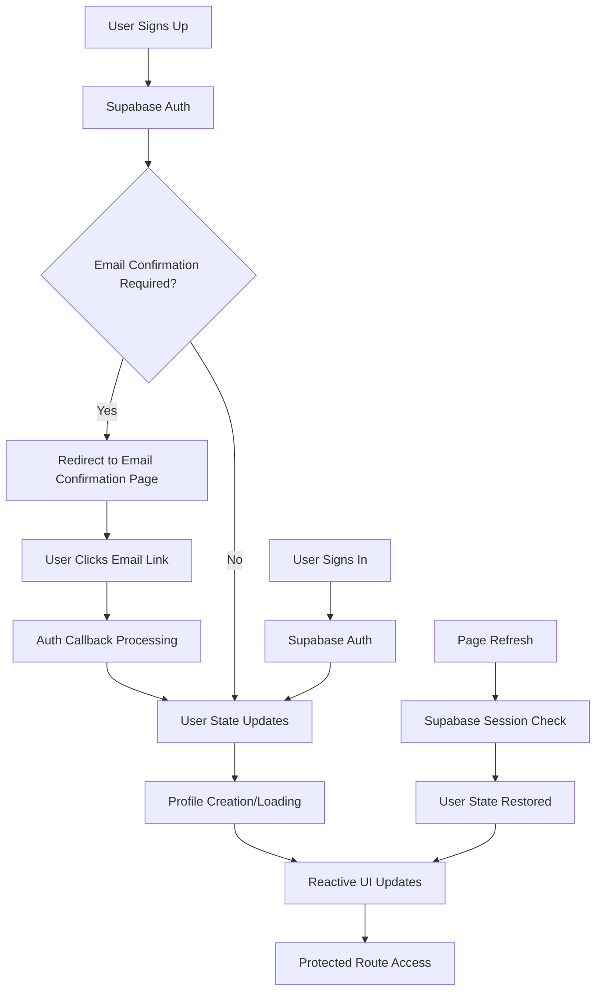

# Authentication Implementation

## Overview

This document describes the implementation of Supabase authentication in the Optiqo Dashboard application, including the migration from custom API-based authentication to Supabase's built-in authentication system.

## Problem Statement

The initial authentication implementation had several issues:
- Users could sign up/in but the app didn't recognize authentication status
- Custom API endpoints were used instead of Supabase's built-in authentication
- Manual profile management instead of leveraging Supabase's reactive user state
- Complex cookie checking and manual session management
- Authentication state wasn't properly synchronized across components
- **Email confirmation was not enforced** - users could access the app without confirming their email
- **Profile creation API had database schema mismatches** causing signup failures
- **Error handling in server routes was inconsistent** leading to unclear error messages

## Solution Architecture

### Core Components

1. **useAuth Composable** (`composables/useAuth.ts`)
2. **Auth Middleware** (`middleware/auth.ts`)
3. **App Initialization** (`app.vue`)
4. **Profile Creation API** (`server/api/auth/create-profile.post.ts`)
5. **UI Components** (Login, Signup, AppLayout, Email Confirmation)
6. **Email Confirmation Flow** (`pages/signup/confirm-email.vue`, `pages/auth/callback.vue`)
7. **Magic Link Authentication** (Passwordless sign-in and sign-up)

### Authentication Flow



## Implementation Details

### 1. useAuth Composable

**Key Changes:**
- Added Supabase integration using `useSupabaseClient()` and `useSupabaseUser()`
- Replaced custom API calls with Supabase's built-in methods
- Added reactive user state management
- Implemented proper error handling with success/error messages
- Added profile creation during signup
- Added user watcher for automatic profile loading

**Key Features:**
```typescript
// Reactive user state
const user = useSupabaseUser()
const isAuthenticated = computed(() => !!user.value)

// Profile management
const userProfile = ref<UserProfile | null>(null)
const loadUserProfile = async () => { /* ... */ }

// Authentication methods
const signUp = async (email, password, firstName, lastName, role, organizationName) => { /* ... */ }
const signIn = async (email, password) => { /* ... */ }
const signOut = async () => { /* ... */ }

// Magic link authentication
const signInWithMagicLink = async (email) => { /* ... */ }
const signUpWithMagicLink = async (email, firstName, lastName, role, organizationName) => { /* ... */ }

// Email confirmation
const resendConfirmationEmail = async (email) => { /* ... */ }
```

### 2. Auth Middleware

**Simplified Logic:**
- Uses Supabase's `useSupabaseUser()` instead of custom profile fetching
- Removed manual cookie checking
- Added database validation for security
- Cleaner, more reliable authentication checks

**Implementation:**
```typescript
export default defineNuxtRouteMiddleware(async (to, from) => {
  const user = useSupabaseUser()
  const supabase = useSupabaseClient()
  
  if (!user.value) {
    return navigateTo('/login')
  }
  
  // Validate user exists in database
  try {
    const { data: profile, error } = await supabase
      .from('profiles')
      .select('user_id')
      .eq('user_id', user.value.id)
      .single()
    
    if (error) {
      await supabase.auth.signOut()
      return navigateTo('/login')
    }
  } catch (err) {
    return navigateTo('/login')
  }
})
```

### 3. App Initialization

**Simplified Structure:**
- Removed manual authentication initialization
- Leverages Supabase's built-in reactivity
- Cleaner component structure

**Template:**
```vue
<template>
  <div>
    <AppLayout v-if="isAuthenticated">
      <NuxtPage />
    </AppLayout>
    <NuxtPage v-else />
  </div>
</template>
```

### 4. Profile Creation API

**Server-side Profile Management:**
- Handles profile creation with service role (bypasses RLS)
- Creates organizations for admin users during signup
- Proper error handling and validation
- Supports optiqo-dashboard's organization-based structure
- **Fixed database schema alignment** for reliable profile creation

**Key Features:**
- Organization creation for admin users
- Profile updates for existing users
- Error handling for database operations
- Service role authentication for RLS bypass
- **Correct field mapping** (user_id, first_name, last_name, role, organization_id)
- **Improved error handling** with proper error propagation

### 5. UI Components

**Updated Components:**
- **Login Page**: Uses new authentication methods, improved typography and spacing, **magic link authentication option with proper font styling and flexbox alignment**
- **Signup Page**: Integrated with profile creation and email confirmation flow, enhanced UX with success messaging, **magic link signup option with required profile info**
- **Email Confirmation Page**: Handles email confirmation with resend functionality, improved messaging
- **Auth Callback**: Enhanced callback handling with smart redirect logic, comprehensive error handling, and **magic link profile creation with authorization code flow support**
- **AppLayout**: Updated to work with new auth system, fixed user display name issues
- **Account Dropdown**: Added user avatar and dropdown menu
- **Account Settings**: Enhanced password validation with user-friendly error handling

### 6. Email Confirmation Flow

**New Implementation:**
- **Signup Process**: Checks if email confirmation is required after account creation
- **Email Confirmation Page**: Shows user-friendly interface with resend functionality
- **Auth Callback**: Handles email confirmation completion and redirects to dashboard
- **Resend Functionality**: Allows users to resend confirmation emails if needed

**Key Features:**
- Enforces email confirmation before dashboard access
- Clear user messaging and instructions
- Proper error handling for confirmation failures
- Seamless redirect flow after confirmation

### 7. Magic Link Authentication

**New Implementation:**
- **Passwordless Sign-In**: Users can sign in using only their email address
- **Passwordless Sign-Up**: New users can create accounts without passwords
- **Profile Creation**: Magic link signups automatically create user profiles with provided information
- **Seamless Integration**: Works alongside traditional password authentication
- **Authorization Code Flow**: Handles both implicit and authorization code flows for magic links

**Key Features:**
- **Login Page**: Toggle between password and magic link authentication with proper font styling
- **Signup Page**: Toggle between password and magic link registration with required profile info
- **Profile Requirements**: Magic link signup requires first name, last name, and organization info
- **Auth Callback**: Enhanced callback handling with smart redirect logic and error handling
- **User Experience**: Clear messaging, intuitive toggles, and proper button alignment with flexbox
- **Error Handling**: Comprehensive error handling for expired, invalid, and failed magic links
- **Smart Redirects**: Immediate redirect for already authenticated users without auth parameters

**Technical Implementation:**
- Uses Supabase's `signInWithOtp()` method for magic link generation
- Handles both hash fragment and query parameter authentication flows
- Automatic session processing without manual code exchange
- Enhanced debugging and logging for troubleshooting
- Fallback mechanisms for session verification

## Key Benefits

### 1. Reactive Authentication
- Authentication state updates automatically across all components
- No manual state synchronization required
- Consistent user experience

### 2. Automatic Session Management
- Supabase handles session persistence and refresh
- Works across page refreshes and browser sessions
- No manual cookie management

### 3. Better Error Handling
- Proper error messages and success feedback
- User-friendly error states
- Consistent error handling patterns

### 4. Email Confirmation Security
- Enforces email verification before app access
- Prevents unauthorized access with unverified emails
- Follows Supabase security best practices

### 5. Simplified Code
- Removed complex manual authentication management
- Cleaner, more maintainable code
- Better separation of concerns

### 6. Enhanced User Experience
- **Clear success messaging** after signup with email confirmation instructions
- **Improved error handling** with user-friendly validation messages
- **Consistent typography** across all authentication forms
- **Better visual hierarchy** with proper spacing and non-bold headings
- **Magic link authentication** for passwordless sign-in and sign-up
- **Intuitive toggle** between password and magic link authentication methods
- **Smart redirects** for already authenticated users to prevent unnecessary loading states
- **Proper button alignment** with flexbox for consistent icon and text positioning
- **Comprehensive error handling** for magic link failures with actionable recovery options

## Database Integration

### Profile Structure
```sql
CREATE TABLE profiles (
  user_id UUID REFERENCES auth.users(id) PRIMARY KEY,
  first_name TEXT,
  last_name TEXT,
  role TEXT CHECK (role IN ('ADMIN', 'EDITOR')) NOT NULL,
  organization_id UUID REFERENCES organizations(id) ON DELETE SET NULL,
  created_at TIMESTAMP WITH TIME ZONE DEFAULT NOW() NOT NULL
);
```

### Organization Structure
```sql
CREATE TABLE organizations (
  id UUID DEFAULT gen_random_uuid() PRIMARY KEY,
  name TEXT NOT NULL,
  created_by UUID REFERENCES auth.users(id),
  viewer_count INTEGER DEFAULT 0,
  created_at TIMESTAMP WITH TIME ZONE DEFAULT NOW(),
  updated_at TIMESTAMP WITH TIME ZONE DEFAULT NOW()
);
```

## Security Considerations

### 1. Row Level Security (RLS)
- Profiles table has RLS policies
- Organizations table has RLS policies
- Service role used for profile creation (bypasses RLS)

### 2. Authentication Flow
- Supabase handles secure authentication
- JWT tokens managed automatically
- Session validation on each request

### 3. Profile Validation
- Middleware validates user exists in database
- Prevents orphaned sessions
- Automatic session cleanup

## Testing

### Manual Testing Checklist
- [ ] User can sign up with email/password
- [ ] User sees clear success message after signup with email confirmation instructions
- [ ] User is redirected to email confirmation page when required
- [ ] User can resend confirmation email if needed
- [ ] User can complete email confirmation via email link
- [ ] User is redirected to dashboard after email confirmation
- [ ] User can sign in with existing credentials
- [ ] **User can sign in with magic link (existing users)**
- [ ] **User can sign up with magic link (new users)**
- [ ] **Magic link signup requires profile information (first name, last name, organization)**
- [ ] **Magic link authentication works for both sign-in and sign-up**
- [ ] **Toggle between password and magic link modes works correctly**
- [ ] Authentication persists across page refreshes
- [ ] User can navigate between protected routes
- [ ] User can sign out successfully
- [ ] Account dropdown shows correct user information (first name, last name)
- [ ] Profile creation works for new users without API errors
- [ ] Organization creation works for admin users
- [ ] Password validation shows clear error messages
- [ ] Form headings are properly styled (not bold, good spacing)

### Error Scenarios
- [ ] Invalid credentials show proper error messages
- [ ] Network errors are handled gracefully
- [ ] Database errors don't break authentication
- [ ] Session expiration is handled properly
- [ ] Email confirmation failures are handled gracefully
- [ ] Resend email functionality works correctly
- [ ] Profile creation API errors are handled properly
- [ ] Password validation errors are displayed clearly
- [ ] User profile data transformation works correctly
- [ ] **Magic link errors are handled gracefully**
- [ ] **Magic link signup validation works correctly**
- [ ] **Magic link profile creation errors are handled properly**
- [ ] **Expired magic links show user-friendly error messages**
- [ ] **Invalid magic links provide clear recovery options**
- [ ] **Authorization code flow errors are handled properly**
- [ ] **Already authenticated users are redirected without loading states**

### Magic Link Error Handling

**Enhanced Error Scenarios:**
- **Expired Magic Links**: Shows "This magic link has expired. Please request a new one."
- **Invalid Magic Links**: Shows "The magic link is invalid. Please request a new one."
- **Access Denied**: Shows "Access was denied. The magic link may have expired or been used already."
- **Server Errors**: Shows "A server error occurred. Please try again later."

**Recovery Actions:**
- **Request New Magic Link**: Redirects to login page with magic link mode enabled
- **Go to Login**: Standard login page access
- **Smart Detection**: Automatically detects magic link errors vs. other authentication errors

**Technical Implementation:**
- Handles both hash fragment (`#access_token=...`) and query parameter (`?code=...`) flows
- Uses Supabase's automatic session processing without manual code exchange
- Comprehensive debugging and logging for troubleshooting
- Fallback mechanisms for session verification

## Migration Notes

### From Custom API to Supabase
1. **Removed custom API endpoints** for authentication
2. **Updated composables** to use Supabase methods
3. **Simplified middleware** to use Supabase user state
4. **Updated UI components** to work with new system
5. **Added profile creation API** for user management
6. **Implemented email confirmation flow** for security

### Breaking Changes
- Authentication methods now return different response formats
- User state is now reactive and automatic
- Profile management is handled differently
- Error handling patterns have changed
- **Email confirmation is now enforced** - users must confirm email before accessing the app
- **Database field names** must match schema (user_id, first_name, last_name)
- **Profile data transformation** required for frontend/backend compatibility
- **Magic link authentication** added as alternative to password authentication
- **Magic link signup** requires profile information but not password
- **Auth callback handling** enhanced with smart redirect logic and comprehensive error handling
- **Button styling** updated to use flexbox for proper icon alignment

## Future Enhancements

### Potential Improvements
1. **Social Authentication**: Add Google, GitHub, etc.
2. **Multi-factor Authentication**: Add 2FA support
3. **Role-based Access Control**: Enhanced permissions
4. **Session Management**: Advanced session controls
5. **Audit Logging**: Track authentication events

### Performance Optimizations
1. **Profile Caching**: Cache user profiles
2. **Lazy Loading**: Load profiles on demand
3. **Connection Pooling**: Optimize database connections
4. **CDN Integration**: Optimize static assets

## Troubleshooting

### Common Issues

**Authentication not persisting:**
- Check Supabase configuration
- Verify environment variables
- Check browser console for errors

**Profile not loading:**
- Check database connection
- Verify RLS policies
- Check profile creation API
- Verify database field names match schema
- Check profile data transformation in useAuth composable

**UI not updating:**
- Check reactive state
- Verify computed properties
- Check component lifecycle

### Debug Tools
- Browser console for client-side errors
- Supabase dashboard for authentication logs
- Database logs for profile operations
- Network tab for API calls

## Conclusion

The migration to Supabase's built-in authentication system has significantly improved the application's reliability, maintainability, and user experience. The reactive nature of Supabase's authentication state eliminates many common authentication bugs and provides a more robust foundation for future development.

The implementation follows best practices for security, error handling, and user experience, providing a solid foundation for the Optiqo Dashboard application. The addition of email confirmation enforcement ensures that only verified users can access the application, significantly improving security posture.

Recent improvements include enhanced user experience with clear success messaging, improved error handling with user-friendly validation, consistent typography across forms, robust profile creation with proper database schema alignment, and **comprehensive magic link authentication for passwordless sign-in and sign-up**. The implementation now includes smart redirect logic for already authenticated users, proper button alignment with flexbox, comprehensive error handling for expired and invalid magic links, and support for both implicit and authorization code flows. These enhancements ensure a smooth, professional authentication flow that reflects the quality of the Optiqo business intelligence platform while providing users with flexible and reliable authentication options.
