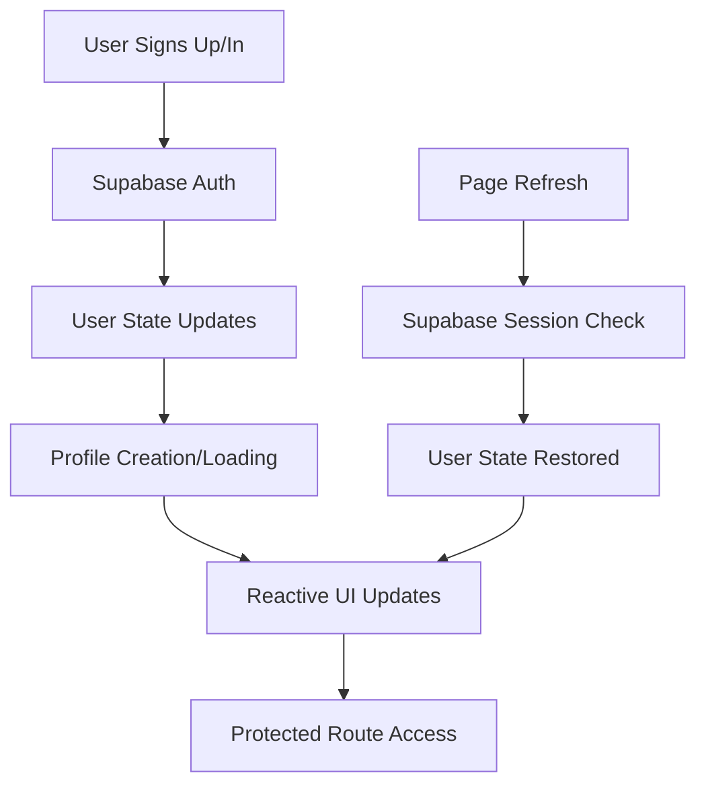

# Authentication Implementation

## Overview

This document describes the implementation of Supabase authentication in the Optiqo Dashboard application, including the migration from custom API-based authentication to Supabase's built-in authentication system.

## Problem Statement

The initial authentication implementation had several issues:
- Users could sign up/in but the app didn't recognize authentication status
- Custom API endpoints were used instead of Supabase's built-in authentication
- Manual profile management instead of leveraging Supabase's reactive user state
- Complex cookie checking and manual session management
- Authentication state wasn't properly synchronized across components

## Solution Architecture

### Core Components

1. **useAuth Composable** (`composables/useAuth.ts`)
2. **Auth Middleware** (`middleware/auth.ts`)
3. **App Initialization** (`app.vue`)
4. **Profile Creation API** (`server/api/auth/create-profile.post.ts`)
5. **UI Components** (Login, Signup, AppLayout)

### Authentication Flow



## Implementation Details

### 1. useAuth Composable

**Key Changes:**
- Added Supabase integration using `useSupabaseClient()` and `useSupabaseUser()`
- Replaced custom API calls with Supabase's built-in methods
- Added reactive user state management
- Implemented proper error handling with success/error messages
- Added profile creation during signup
- Added user watcher for automatic profile loading

**Key Features:**
```typescript
// Reactive user state
const user = useSupabaseUser()
const isAuthenticated = computed(() => !!user.value)

// Profile management
const userProfile = ref<UserProfile | null>(null)
const loadUserProfile = async () => { /* ... */ }

// Authentication methods
const signUp = async (email, password, firstName, lastName, role, organizationName) => { /* ... */ }
const signIn = async (email, password) => { /* ... */ }
const signOut = async () => { /* ... */ }
```

### 2. Auth Middleware

**Simplified Logic:**
- Uses Supabase's `useSupabaseUser()` instead of custom profile fetching
- Removed manual cookie checking
- Added database validation for security
- Cleaner, more reliable authentication checks

**Implementation:**
```typescript
export default defineNuxtRouteMiddleware(async (to, from) => {
  const user = useSupabaseUser()
  const supabase = useSupabaseClient()
  
  if (!user.value) {
    return navigateTo('/login')
  }
  
  // Validate user exists in database
  try {
    const { data: profile, error } = await supabase
      .from('profiles')
      .select('user_id')
      .eq('user_id', user.value.id)
      .single()
    
    if (error) {
      await supabase.auth.signOut()
      return navigateTo('/login')
    }
  } catch (err) {
    return navigateTo('/login')
  }
})
```

### 3. App Initialization

**Simplified Structure:**
- Removed manual authentication initialization
- Leverages Supabase's built-in reactivity
- Cleaner component structure

**Template:**
```vue
<template>
  <div>
    <AppLayout v-if="isAuthenticated">
      <NuxtPage />
    </AppLayout>
    <NuxtPage v-else />
  </div>
</template>
```

### 4. Profile Creation API

**Server-side Profile Management:**
- Handles profile creation with service role (bypasses RLS)
- Creates organizations for admin users during signup
- Proper error handling and validation
- Supports optiqo-dashboard's organization-based structure

**Key Features:**
- Organization creation for admin users
- Profile updates for existing users
- Error handling for database operations
- Service role authentication for RLS bypass

### 5. UI Components

**Updated Components:**
- **Login Page**: Uses new authentication methods
- **Signup Page**: Integrated with profile creation
- **Auth Callback**: Fixed to use Supabase user state
- **AppLayout**: Updated to work with new auth system
- **Account Dropdown**: Added user avatar and dropdown menu

## Key Benefits

### 1. Reactive Authentication
- Authentication state updates automatically across all components
- No manual state synchronization required
- Consistent user experience

### 2. Automatic Session Management
- Supabase handles session persistence and refresh
- Works across page refreshes and browser sessions
- No manual cookie management

### 3. Better Error Handling
- Proper error messages and success feedback
- User-friendly error states
- Consistent error handling patterns

### 4. Simplified Code
- Removed complex manual authentication management
- Cleaner, more maintainable code
- Better separation of concerns

## Database Integration

### Profile Structure
```sql
CREATE TABLE profiles (
  user_id UUID REFERENCES auth.users(id) PRIMARY KEY,
  first_name TEXT,
  last_name TEXT,
  role TEXT CHECK (role IN ('ADMIN', 'EDITOR')) NOT NULL,
  organization_id UUID REFERENCES organizations(id) ON DELETE SET NULL,
  created_at TIMESTAMP WITH TIME ZONE DEFAULT NOW() NOT NULL
);
```

### Organization Structure
```sql
CREATE TABLE organizations (
  id UUID DEFAULT gen_random_uuid() PRIMARY KEY,
  name TEXT NOT NULL,
  created_by UUID REFERENCES auth.users(id),
  viewer_count INTEGER DEFAULT 0,
  created_at TIMESTAMP WITH TIME ZONE DEFAULT NOW(),
  updated_at TIMESTAMP WITH TIME ZONE DEFAULT NOW()
);
```

## Security Considerations

### 1. Row Level Security (RLS)
- Profiles table has RLS policies
- Organizations table has RLS policies
- Service role used for profile creation (bypasses RLS)

### 2. Authentication Flow
- Supabase handles secure authentication
- JWT tokens managed automatically
- Session validation on each request

### 3. Profile Validation
- Middleware validates user exists in database
- Prevents orphaned sessions
- Automatic session cleanup

## Testing

### Manual Testing Checklist
- [ ] User can sign up with email/password
- [ ] User is automatically authenticated after signup
- [ ] User can sign in with existing credentials
- [ ] Authentication persists across page refreshes
- [ ] User can navigate between protected routes
- [ ] User can sign out successfully
- [ ] Account dropdown shows user information
- [ ] Profile creation works for new users
- [ ] Organization creation works for admin users

### Error Scenarios
- [ ] Invalid credentials show proper error messages
- [ ] Network errors are handled gracefully
- [ ] Database errors don't break authentication
- [ ] Session expiration is handled properly

## Migration Notes

### From Custom API to Supabase
1. **Removed custom API endpoints** for authentication
2. **Updated composables** to use Supabase methods
3. **Simplified middleware** to use Supabase user state
4. **Updated UI components** to work with new system
5. **Added profile creation API** for user management

### Breaking Changes
- Authentication methods now return different response formats
- User state is now reactive and automatic
- Profile management is handled differently
- Error handling patterns have changed

## Future Enhancements

### Potential Improvements
1. **Social Authentication**: Add Google, GitHub, etc.
2. **Multi-factor Authentication**: Add 2FA support
3. **Role-based Access Control**: Enhanced permissions
4. **Session Management**: Advanced session controls
5. **Audit Logging**: Track authentication events

### Performance Optimizations
1. **Profile Caching**: Cache user profiles
2. **Lazy Loading**: Load profiles on demand
3. **Connection Pooling**: Optimize database connections
4. **CDN Integration**: Optimize static assets

## Troubleshooting

### Common Issues

**Authentication not persisting:**
- Check Supabase configuration
- Verify environment variables
- Check browser console for errors

**Profile not loading:**
- Check database connection
- Verify RLS policies
- Check profile creation API

**UI not updating:**
- Check reactive state
- Verify computed properties
- Check component lifecycle

### Debug Tools
- Browser console for client-side errors
- Supabase dashboard for authentication logs
- Database logs for profile operations
- Network tab for API calls

## Conclusion

The migration to Supabase's built-in authentication system has significantly improved the application's reliability, maintainability, and user experience. The reactive nature of Supabase's authentication state eliminates many common authentication bugs and provides a more robust foundation for future development.

The implementation follows best practices for security, error handling, and user experience, providing a solid foundation for the Optiqo Dashboard application.
