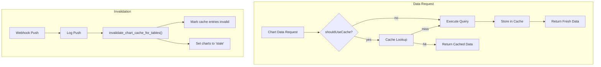

# Chart Data Caching

This document describes the chart data caching system, including the database schema, cache key generation, cache decision logic, invalidation mechanisms, and interaction with dashboard filters.

## Overview

The caching system stores pre-computed chart query results in the `chart_data_cache` table and uses table-level dependency tracking for intelligent invalidation. It supports three data source strategies:

| Source | Cache Strategy | Invalidation |
|--------|---------------|--------------|
| **Optiqoflow** | Cached per tenant + cache key | Automatic on webhook data push |
| **External MySQL** | Permanent (never auto-invalidates) | Manual refresh only |
| **Supabase Synced** | Permanent (never auto-invalidates) | Manual refresh only |



## Database Schema

### `chart_data_cache`

Stores pre-computed chart query results, partitioned by `chart_id`, `tenant_id`, and `cache_key`.

```sql
CREATE TABLE public.chart_data_cache (
    id              UUID PRIMARY KEY DEFAULT gen_random_uuid(),
    chart_id        BIGINT NOT NULL REFERENCES charts(id) ON DELETE CASCADE,
    tenant_id       UUID NOT NULL,
    cache_key       TEXT NOT NULL,           -- SHA-256 hash of query parameters
    cached_data     JSONB NOT NULL,          -- The actual chart data (rows)
    row_count       INTEGER,
    
    -- Validity
    cached_at       TIMESTAMPTZ NOT NULL DEFAULT NOW(),
    valid_until     TIMESTAMPTZ,             -- Optional TTL
    is_valid        BOOLEAN DEFAULT true,
    
    -- Dependencies
    source_tables   TEXT[] NOT NULL,          -- Tables this cache depends on
    last_data_push_at TIMESTAMPTZ,
    
    -- Metadata
    query_duration_ms INTEGER,
    compressed      BOOLEAN DEFAULT false,
    
    created_at      TIMESTAMPTZ DEFAULT NOW(),
    updated_at      TIMESTAMPTZ DEFAULT NOW(),
    
    UNIQUE(chart_id, tenant_id, cache_key)
);
```

**Indexes:**
- `idx_cache_chart_tenant` — lookup by `(chart_id, tenant_id)`
- `idx_cache_valid` — partial index on `is_valid = true`
- `idx_cache_tables` — GIN index on `source_tables` for invalidation queries
- `idx_cache_tenant` — lookup by `tenant_id`

### `chart_table_dependencies`

Tracks which database tables each chart depends on. Used to determine which cache entries to invalidate when a table receives new data.

```sql
CREATE TABLE public.chart_table_dependencies (
    id              UUID PRIMARY KEY DEFAULT gen_random_uuid(),
    chart_id        BIGINT NOT NULL REFERENCES charts(id) ON DELETE CASCADE,
    table_name      TEXT NOT NULL,
    schema_name     TEXT DEFAULT 'optiqoflow',
    dependency_type TEXT DEFAULT 'query',     -- 'query', 'filter', 'primary'
    created_at      TIMESTAMPTZ DEFAULT NOW(),
    UNIQUE(chart_id, table_name, schema_name)
);
```

### Columns on `charts` Table

| Column | Type | Default | Purpose |
|--------|------|---------|---------|
| `has_dynamic_filter` | boolean | `false` | Set to `true` if the chart uses relative date filters (e.g., "last 7 days") |
| `cache_status` | text | `'unknown'` | O(1) cache decision: `cached`, `stale`, `dynamic`, `unknown` |

### Column on `dashboards` Table

| Column | Type | Default | Purpose |
|--------|------|---------|---------|
| `dynamic_columns` | jsonb | `'[]'` | Array of column names (e.g., `["created_at", "event_date"]`) that should trigger cache bypass when targeted by dashboard-level filters |

---

## Cache Key Generation

Located in: `server/utils/chart-cache.ts` → `generateCacheKey()`

The cache key is a SHA-256 hash of the chart ID combined with normalized query parameters:

```typescript
export function generateCacheKey(chartId: number, params: Record<string, unknown>): string {
    const normalized = JSON.stringify(params, Object.keys(params).sort())
    return createHash('sha256').update(`${chartId}:${normalized}`).digest('hex')
}
```

At call time in `data.get.ts`, the key is generated from:

```typescript
const cacheKey = generateCacheKey(chartId, {
    sql: safeSql,           // The final SQL (after filter injection)
    dataSource: storageLocation,
    filters: filterOverrides // Dashboard-level filter overrides
})
```

> [!IMPORTANT]
> Because `filterOverrides` are included in the hash, **each unique combination of dashboard filter values produces a distinct cache entry**. This means static dashboard filters (values, text rules, numeric constraints) are automatically cached as separate entries — no special handling is needed for them.

---

## Cache Decision (`shouldUseCache`)

Located in: `server/api/dashboards/[id]/charts/[chartId]/data.get.ts`

The cache decision is an O(1) check:

```typescript
const shouldUseCache =
    usePermanentCache(storageLocation) ||
    (storageLocation === 'optiqoflow' &&
     chart.cache_status !== 'dynamic' &&
     !chart.has_dynamic_filter)
```

| Condition | Result |
|-----------|--------|
| `storageLocation = 'external'` or `'supabase_synced'` | **Always cache** (permanent) |
| `storageLocation = 'optiqoflow'` + `cache_status = 'dynamic'` | **Never cache** |
| `storageLocation = 'optiqoflow'` + `has_dynamic_filter = true` | **Never cache** |
| `storageLocation = 'optiqoflow'` + status is `cached`/`stale`/`unknown` + no dynamic filters | **Use cache** |

### `usePermanentCache()` helper

Located in: `server/utils/storageHelpers.ts`

```typescript
export function usePermanentCache(loc: string | null | undefined): boolean {
    return loc === 'external' || loc === 'supabase_synced'
}
```

External MySQL and synced databases don't have change detection (no webhooks), so their cache is permanent and only refreshed manually.

### Cache Status Values

| Status | When set | Behavior |
|--------|----------|----------|
| `cached` | After successful cache write | Use cached data |
| `stale` | After webhook invalidation | Query fresh, update cache |
| `dynamic` | Chart with time-relative filters | Always query fresh |
| `unknown` | On chart creation | Query fresh, determine status |

---

## Request Lifecycle

### 1. Request Parsing

The `data.get.ts` endpoint receives the chart data request:

```
GET /api/dashboards/:id/charts/:chartId/data?filterOverrides=[...]
```

- `filterOverrides` is an optional JSON-encoded array of `FilterOverride` objects
- If present, filters are parsed and later injected into the SQL

### 2. Tenant Resolution

The tenant ID is derived for cache partitioning:

1. Get the user's organization from their profile
2. Look up `tenant_id` on the organization
3. Fall back to `00000000-0000-0000-0000-000000000000` (Nil UUID) for non-tenant connections

> [!NOTE]
> The Nil UUID fallback prevents PostgreSQL `invalid input syntax for type uuid` errors. It was introduced to handle external MySQL and supabase_synced connections that don't belong to a specific tenant.

### 3. Filter Injection

If `filterOverrides` are present, they are injected into the SQL:

```typescript
if (filterOverrides.length > 0 && connectionId) {
    filterResult = injectFiltersIntoSql(safeSql, filterOverrides, Number(connectionId))
    safeSql = filterResult.sql
}
```

This happens **before** cache key generation, so the cache key reflects the final filtered SQL.

### 4. Cache Lookup

If `shouldUseCache` is true, check for a valid cache entry:

```typescript
const cached = await getCachedChartData(supabaseAdmin, chartId, effectiveTenantId, cacheKey)
if (cached) {
    return { columns, rows: cached.data, meta: { cached: true, cacheHit: true, ... } }
}
```

### 5. Query Execution

On cache miss, execute the query against the appropriate data source:

| Storage Location | Execution Path |
|-----------------|----------------|
| `optiqoflow` | `executeOptiqoflowQuery()` with tenant role switching |
| `supabase_synced` | `executeInternalStorageQuery()` with schema isolation |
| `external` | `withMySqlConnectionConfig()` direct MySQL query |

### 6. Cache Storage

After successful query execution, store results asynchronously (non-blocking):

```typescript
if (shouldUseCache) {
    event.waitUntil(
        setCachedChartData(
            supabaseAdmin, chartId, effectiveTenantId, cacheKey,
            rows,
            storageLocation !== 'optiqoflow' ? ['_permanent'] : sourceTables,
            queryDurationMs
        )
    )
}
```

Permanent cache entries use `['_permanent']` as `source_tables` — this special marker prevents the invalidation function from affecting them.

### 7. Filter Fallback

If a filtered query fails, the system falls back to the unfiltered query:

```typescript
try {
    rows = await executeQuery(safeSql)
} catch (filterError) {
    if (filterResult.appliedFilters > 0) {
        rows = await executeQuery(originalSql)  // Unfiltered fallback
        meta.filterWarning = 'Filter could not be applied to this chart'
    } else {
        throw filterError
    }
}
```

---

## Dependency Tracking

### Trigger Points

Dependencies are automatically updated when charts are created or modified:

- `POST /api/reporting/charts` — on chart creation
- `PUT /api/reporting/charts` — on chart update

Both endpoints trigger `extractTablesFromStateJson()` and `upsertChartDependencies()` via `event.waitUntil()`.

### Table Extraction (`extractTablesFromStateJson`)

Located in: `server/utils/chart-cache.ts`

Parses the complex chart `state_json` to identify all referenced tables:

| Source | Fields Checked |
|--------|---------------|
| Top-level & `internal` | `table`, `selectedDatasetId` |
| `selectedColumns` | `[].table` |
| `xDimensions` | `[].table` |
| `yMetrics` | `[].table` |
| `breakdowns` | `[].table` |
| `filters` | `[].table` |
| `joins` | `[].leftTable`, `[].rightTable` |

---

## Cache Invalidation

### Webhook-Triggered Invalidation

When the OptiqoFlow webhook (`POST /api/optiqo-webhook`) receives a data push:

1. The affected table name is identified
2. `invalidateCacheForTables(supabase, tenantId, [tableName])` is called (async, non-blocking)
3. The Postgres function `invalidate_chart_cache_for_tables()` runs:

```sql
-- Mark cache entries as invalid (skip permanent cache)
UPDATE chart_data_cache
SET is_valid = false, updated_at = now()
WHERE tenant_id = p_tenant_id
  AND is_valid = true
  AND source_tables && p_table_names
  AND NOT ('_mysql_permanent' = ANY(source_tables));

-- Update chart cache_status to 'stale'
UPDATE charts c
SET cache_status = 'stale'
FROM chart_table_dependencies d
WHERE c.id = d.chart_id
  AND d.table_name = ANY(p_table_names)
  AND c.cache_status = 'cached';
```

### Cleanup

A Postgres function `cleanup_old_chart_cache()` handles garbage collection:

- Deletes invalid cache entries older than 7 days
- Deletes expired entries (past `valid_until`)

---

## Dynamic Filter Detection

Located in: `server/utils/chart-cache.ts` → `hasRelativeDateFilters()`

Charts with relative date filters are detected and flagged:

```typescript
const RELATIVE_DATE_OPERATORS = [
    'last_n_days', 'last_n_weeks', 'last_n_months',
    'this_week', 'this_month', 'today', 'yesterday'
]
```

When detected, `has_dynamic_filter` is set to `true` on the chart, causing cache bypass.

---

## Dashboard Filters and Caching

### Static Filters (Fully Cached)

Dashboard filters with static values (multi-select values, text rules, numeric constraints) produce unique cache keys because `filterOverrides` is included in the cache key hash. Each distinct filter combination is cached independently.

**Example:** If a dashboard filter selects `gender = 'M'`, the cache key includes this filter state. Switching to `gender = 'F'` produces a different cache key, resulting in a separate cache entry. Both entries are valid and served on subsequent requests.

### Dynamic Filters (Cache Bypass — Current Gap)

The `shouldUseCache` decision currently only checks the chart's own `has_dynamic_filter` property. It does **not** account for:

1. **Dashboard-level dynamic date operators** — If a dashboard filter uses a relative date operator (e.g., `last_n_days`), the result changes over time and should bypass cache
2. **Dashboard `dynamic_columns`** — Columns marked as dynamic on the dashboard (stored in `dashboards.dynamic_columns`) should bypass cache when targeted by filters

> [!WARNING]
> This is a known gap. Dashboard-level relative date filters and `dynamic_columns` are not currently checked in the `shouldUseCache` decision. Charts filtered with time-relative dashboard filters may return stale cached data.

---

## Frontend Integration

### DashboardChartRenderer.vue

The chart renderer component handles the filter + cache interaction:

1. **Filter signature tracking** — A computed `activeFilterSignature` watches for filter value changes
2. **Preloaded data bypass** — When dashboard filters are active, preloaded cached data is skipped and a fresh request is made
3. **Filter overrides** — Active filters are serialized as `filterOverrides` query parameter

```typescript
// Skip preloaded cache when filters are active
if (props.dataStatus === 'cached' && props.preloadedColumns && props.preloadedRows) {
    if (!props.dashboardFilters?.length) {
        // No filters - use cached data directly
        return
    }
    // Has filters - fall through to fetch with filters
}
```

### Response Metadata

The data endpoint returns caching metadata:

```json
{
    "columns": [...],
    "rows": [...],
    "meta": {
        "cached": true,
        "cacheHit": true,
        "dataSource": "optiqoflow",
        "permanent": false,
        "durationMs": 12,
        "filtersApplied": 1,
        "filtersSkipped": 0,
        "filterWarning": null
    }
}
```

---

## Key Files

| File | Purpose |
|------|---------|
| [chart-cache.ts](file:///home/paulsanswrk/nodejs/optiqo-dashboard/server/utils/chart-cache.ts) | Cache utilities: key generation, get/set, invalidation, dependency tracking, table extraction |
| [data.get.ts](file:///home/paulsanswrk/nodejs/optiqo-dashboard/server/api/dashboards/%5Bid%5D/charts/%5BchartId%5D/data.get.ts) | Dashboard chart data endpoint with full cache flow |
| [chart-data.post.ts](file:///home/paulsanswrk/nodejs/optiqo-dashboard/server/api/reporting/chart-data.post.ts) | Chart builder preview endpoint (also uses caching) |
| [chart-cache-schema.ts](file:///home/paulsanswrk/nodejs/optiqo-dashboard/lib/db/chart-cache-schema.ts) | Drizzle schema for `chart_data_cache` and `chart_table_dependencies` |
| [storageHelpers.ts](file:///home/paulsanswrk/nodejs/optiqo-dashboard/server/utils/storageHelpers.ts) | `usePermanentCache()` helper |
| [filterInjection.ts](file:///home/paulsanswrk/nodejs/optiqo-dashboard/server/utils/filterInjection.ts) | SQL filter injection (modifies query before cache key generation) |
| [DashboardChartRenderer.vue](file:///home/paulsanswrk/nodejs/optiqo-dashboard/components/DashboardChartRenderer.vue) | Frontend chart rendering with filter + cache integration |
| [optiqo-webhook.post.ts](file:///home/paulsanswrk/nodejs/optiqo-dashboard/server/api/optiqo-webhook.post.ts) | Webhook handler that triggers cache invalidation |

## Migration

| Migration | Purpose |
|-----------|---------|
| `20260122170100_chart_cache_schema.sql` | Creates cache tables, indexes, `has_dynamic_filter`/`cache_status` columns, `dynamic_columns` on dashboards, invalidation + cleanup functions |

See also: [Multi-Tenant Data Architecture](../optiqoflow/multi-tenant-data-architecture.md) for tenant isolation details.
