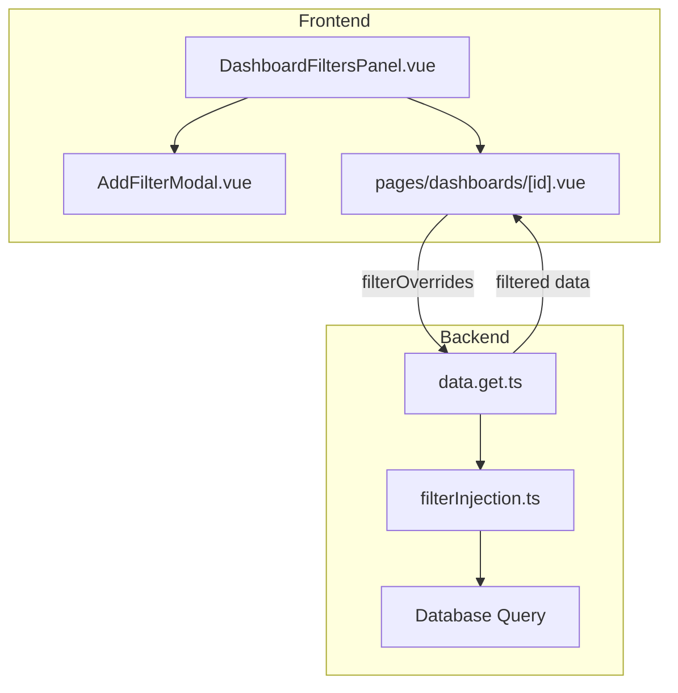

# Dashboard Filters Implementation

This document describes the implementation of dashboard filters in Optiqo, including the database schema, UI components, and the filter injection mechanism.

## Overview

Dashboard filters allow users to interactively filter data across all charts in a dashboard. Filters are:
- **Persisted** in the database per dashboard
- **Applied dynamically** to chart SQL queries at runtime
- **Configurable** with multiple filter modes (values, text rules, constraints, date ranges)

## Architecture



## Database Schema

### `dashboard_filters` Table

```sql
CREATE TABLE dashboard_filters (
    id              UUID PRIMARY KEY DEFAULT gen_random_uuid(),
    dashboard_id    UUID NOT NULL REFERENCES dashboards(id) ON DELETE CASCADE,
    connection_id   BIGINT REFERENCES data_connections(id) ON DELETE SET NULL,
    field_id        TEXT NOT NULL,       -- Column name to filter on
    field_table     TEXT NOT NULL,       -- Table containing the column
    field_type      TEXT NOT NULL,       -- 'text', 'numeric', 'date'
    filter_name     TEXT NOT NULL,       -- Display name
    is_visible      BOOLEAN DEFAULT true,
    position        INTEGER DEFAULT 0,   -- Display order
    filter_mode     TEXT DEFAULT 'values', -- 'values', 'text_rule', 'constraint', 'dynamic_range'
    config          JSONB DEFAULT '{}',    -- Mode-specific configuration
    current_value   JSONB,                 -- Currently selected value(s)
    created_at      TIMESTAMPTZ DEFAULT NOW(),
    updated_at      TIMESTAMPTZ DEFAULT NOW()
);
```

### Filter Modes

| Mode | Description | Config Structure |
|------|-------------|------------------|
| `values` | Multi-select from distinct values | `{ values: string[] }` |
| `text_rule` | Text pattern matching | `{ operator: 'contain'|'start_with'|'end_with', value: string }` |
| `constraint` | Numeric comparisons | `{ operator: 'eq'|'lt'|'gt'|'between', value: number, value2?: number }` |
| `dynamic_range` | Date/time ranges | `{ periods: string[], selectedPeriod?: string }` |

---

## Components

### AddFilterModal.vue

Modal for creating/editing filters:
- Left pane: Data source and field selection tree
- Right pane: Filter configuration (name, mode, values)

**Props:**
- `open: boolean` - Modal visibility
- `connections: Connection[]` - Available data connections
- `editFilter?: DashboardFilter` - Filter to edit (optional)

**Events:**
- `@save(filter: DashboardFilter)` - Filter created/updated
- `@close` - Modal closed

---

### DashboardFiltersPanel.vue

Sidebar panel displaying active filters:
- Shows all configured filters
- Allows users to select filter values
- Supports collapse/expand

**Props:**
- `filters: DashboardFilter[]` - List of filters
- `editMode: boolean` - Whether editing is allowed
- `collapsed: boolean` - Panel collapsed state

**Events:**
- `@update(filter)` - Filter value changed
- `@edit(filter)` - Edit filter requested
- `@delete(filter)` - Delete filter requested
- `@add-filter` - Add new filter

---

## Filter Injection

### Overview

When a user applies a filter, the filter condition is **injected into the chart's SQL query** before execution. This happens in the chart data endpoint.

### Flow

1. **Frontend** sends `filterOverrides` parameter with active filter conditions
2. **data.get.ts** receives the request and parses filter overrides
3. **filterInjection.ts** analyzes the SQL and injects WHERE clauses
4. **Modified SQL** is executed against the database
5. **Filtered data** is returned to the frontend

### Filter Injection Logic

Located in: `server/utils/filterInjection.ts`

#### Key Functions

```typescript
// Extract table names from SQL query
extractTablesFromSql(sql: string): string[]

// Check if filter applies to the query
shouldApplyFilter(sql: string, filter: FilterOverride): boolean

// Inject filter conditions into SQL
injectFiltersIntoSql(sql: string, filters: FilterOverride[], chartConnectionId?: number): FilterInjectionResult
```

#### Injection Rules

1. **Table Matching**: Filter is only applied if its table exists in the SQL query
2. **Connection Matching**: Filter is skipped if it targets a different data connection
3. **Position**: WHERE clause is injected **before** GROUP BY, HAVING, ORDER BY, or LIMIT
4. **Existing WHERE**: If query has WHERE, filter is added with AND
5. **Table Aliases**: When SQL uses aliases (e.g., `employees e`), filters use the alias (`e.gender`) instead of the full table name

#### Table Alias Handling

The filter injection automatically detects table aliases in SQL queries and uses them:

```sql
-- Original query with aliases
SELECT e.first_name FROM employees e JOIN departments d ON ...

-- Filter on 'employees.gender' becomes:
WHERE `e`.`gender` = 'M'  -- Uses alias 'e', not 'employees'
```

This prevents "Unknown column" errors that occur when the full table name is used in queries that define aliases.

#### Example


**Original SQL:**
```sql
SELECT d.dept_name, AVG(s.salary) as avg_salary
FROM departments d
INNER JOIN dept_emp de ON d.dept_no = de.dept_no
INNER JOIN employees e ON de.emp_no = e.emp_no
INNER JOIN salaries s ON e.emp_no = s.emp_no
GROUP BY d.dept_name
ORDER BY avg_salary DESC
```

**With filter `employees.gender = 'M'`:**
```sql
SELECT d.dept_name, AVG(s.salary) as avg_salary
FROM departments d
INNER JOIN dept_emp de ON d.dept_no = de.dept_no
INNER JOIN employees e ON de.emp_no = e.emp_no
INNER JOIN salaries s ON e.emp_no = s.emp_no
WHERE `employees`.`gender` = 'M'
GROUP BY d.dept_name
ORDER BY avg_salary DESC
```

---

### Error Handling

The filter injection includes robust error handling:

| Scenario | Behavior |
|----------|----------|
| Filter table not in query | Filter skipped, chart shows unfiltered data |
| Filter connection mismatch | Filter skipped, chart shows unfiltered data |
| Filtered query fails | Fallback to unfiltered query with warning banner |
| Empty result | Shows "No data available - Try adjusting your filters" |

---

## API Endpoint

### GET `/api/dashboards/:id/charts/:chartId/data`

**Query Parameters:**
- `filterOverrides` (optional): JSON array of filter conditions

**Response:**
```json
{
  "columns": [{ "key": "dept_name", "label": "dept_name" }, ...],
  "rows": [{ "dept_name": "Sales", "avg_salary": "80667.60" }, ...],
  "meta": {
    "filtersApplied": 1,
    "filtersSkipped": 0,
    "filterWarning": "Filter could not be applied to this chart"
  }
}
```

---

## Testing

Unit tests are located in `tests/filters/filterInjection.test.ts`:

```bash
npx vitest run tests/filters/filterInjection.test.ts
```

**Test Coverage:**
- Table extraction from SQL
- Filter applicability checks
- Simple query injection
- Aggregate queries (GROUP BY, HAVING)
- Complex joins
- Subqueries
- Window functions
- All filter operators
- Error scenarios

---

## Related Files

| File | Purpose |
|------|---------|
| `lib/db/schema.ts` | Database schema definition |
| `components/AddFilterModal.vue` | Filter creation/editing modal |
| `components/DashboardFiltersPanel.vue` | Filter sidebar panel |
| `components/DashboardChartRenderer.vue` | Chart rendering with filter support |
| `server/utils/filterInjection.ts` | SQL filter injection logic |
| `server/api/dashboards/[id]/charts/[chartId]/data.get.ts` | Chart data endpoint |
| `tests/filters/filterInjection.test.ts` | Unit tests |
