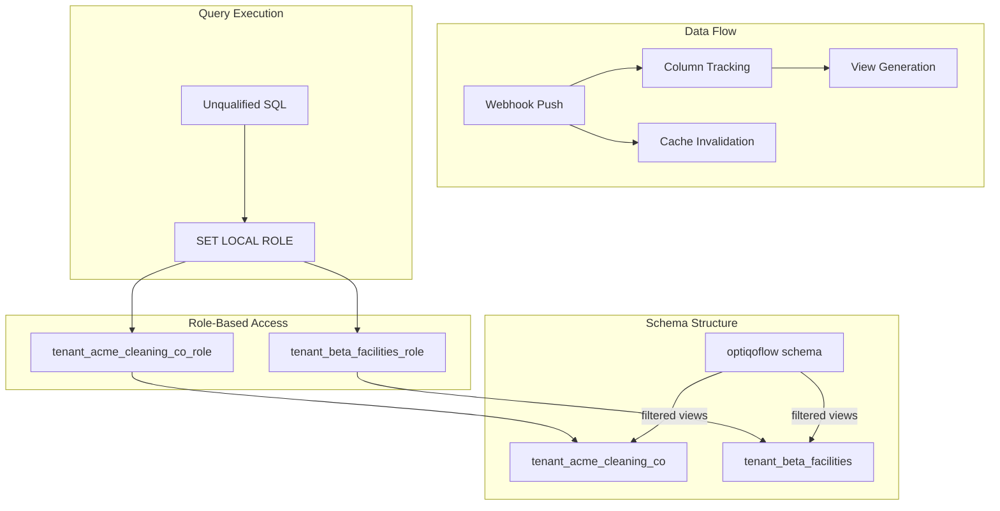

# Multi-Tenant Data Architecture

This document describes the multi-tenant data isolation and caching implementation for the Optiqo dashboard.

## Overview

The system provides per-tenant data isolation using PostgreSQL schema and role-based access:

- **Per-Tenant Schemas**: Each tenant gets a dedicated schema (`tenant_{short_name}`)
- **Per-Tenant Roles**: Role-based isolation with restricted privileges
- **Automatic Tenant Registration**: New tenants are automatically registered on first data sync
- **Tenant Views**: Dynamically generated views with row and column isolation
- **FK Metadata & Auto-Join**: Relationship metadata enables automatic table joins
- **Chart Data Caching**: Pre-computed results with automatic invalidation
- **Dual Data Source Support**: Different caching strategies for Optiqoflow vs MySQL

## Architecture



## Current Tenants

| Tenant Name | Short Name | Schema | Role |
|-------------|------------|--------|------|
| Acme Cleaning Co | `acme_cleaning_co` | `tenant_acme_cleaning_co` | `tenant_acme_cleaning_co_role` |
| Beta Facilities | `beta_facilities` | `tenant_beta_facilities` | `tenant_beta_facilities_role` |
| Puhastusekpert OÜ | `puhastusekpert_o` | `tenant_puhastusekpert_o` | `tenant_puhastusekpert_o_role` |
| Visera AB | `visera_ab` | `tenant_visera_ab` | `tenant_visera_ab_role` |

## Organization-Tenant Mapping

Organizations in the dashboard can be associated with tenants from the OptiqoFlow system. This association enables:
- Automatic creation of immutable OptiqoFlow data connections
- Tenant-specific data access and filtering
- Per-organization data isolation

### Database Schema

```sql
-- organizations table includes tenant_id
ALTER TABLE organizations ADD COLUMN tenant_id UUID REFERENCES optiqoflow.tenants(id);
```

### SUPERADMIN Management

Only users with the `SUPERADMIN` role can:
- View the list of available tenants
- Assign tenants to organizations (both during creation and for existing orgs)
- Remove tenant associations from organizations

**UI Locations:**
- Organization creation: Tenant selector dropdown (SUPERADMIN only)
- Organization details page: Tenant selector with "Edit" capability (SUPERADMIN only)
- For non-SUPERADMIN users: Tenant name is displayed as read-only if assigned

### Immutable OptiqoFlow Connections

When a tenant is assigned to an organization (either during creation or later), the system automatically creates an **immutable OptiqoFlow data connection** with these characteristics:

- **Connection Name**: `OptiqoFlow Data ({Organization Name})`  - Unique per organization
- **Storage Location**: `optiqoflow`
- **Database Type**: `postgresql`
- **Immutability**: `is_immutable: true`
- **Auto-schema**: Schema and join graph are automatically fetched and stored
- **Non-deletable**: Cannot be deleted or renamed by users
- **Connection properties protected**: Server, username, password, database name, internal name cannot be edited
- **Schema editing allowed**: Users CAN edit `schema_json` to:
  - Exclude/include tables
  - Customize column selections
  - Modify column labels and types
  - Define custom references (foreign keys)

**Implementation Details:**
- Auto-created in `/server/api/organizations/index.post.ts` (new org with tenant)
- Auto-created in `/server/api/organizations/[id]/tenant.put.ts` (assigning tenant to existing org)
- **Owner Assignment**: Uses organization creator (`created_by`) as `owner_id` for consistency across different SUPERADMIN users
- Duplicate checking prevents multiple OptiqoFlow connections per organization
- Schema editor is accessible via "Edit Schema" button (bypasses integration wizard)

**UI Behavior:**
- Data Sources page: Shows "Edit Schema" button instead of "Edit" for immutable connections
- Organization details page: Edit button navigates to schema editor for immutable connections
- Regular connections: Continue to show "Edit" button that goes to integration wizard

### API Endpoints

| Endpoint | Method | Purpose | Access |
|----------|--------|---------|--------|
| `/api/tenants` | GET | List all available tenants | SUPERADMIN |
| `/api/organizations/[id]/tenant` | PUT | Assign/remove tenant from org | SUPERADMIN |
| `/api/organizations/[id]` | GET | Get org details (includes tenantName) | All authenticated |
| `/api/organizations` | POST | Create org with optional tenant | ADMIN/SUPERADMIN |

## Tenant Short Names

> [!IMPORTANT]
> Tenant short names are stored in `tenants.tenant_short_names`, **not** in `optiqoflow.tenants`.
> The `optiqoflow` schema is externally managed and may be recreated, so short names are persisted in the dashboard-controlled `tenants` schema.

### Table Schema

```sql
CREATE TABLE tenants.tenant_short_names (
    tenant_id UUID PRIMARY KEY,
    short_name TEXT NOT NULL UNIQUE,
    created_at TIMESTAMPTZ DEFAULT NOW(),
    updated_at TIMESTAMPTZ DEFAULT NOW()
);
```

### Short Name Generation

- Lowercase, alphanumeric with underscores
- Max 30 characters  
- Collision handling: appends `_N` suffix
- Managed via `tenants.generate_tenant_short_name()` function

### Helper Functions (tenants schema)

- `get_tenant_short_name(tenant_id)` - Lookup short name
- `get_tenant_schema(tenant_id)` - Returns `tenant_{short_name}`
- `get_tenant_role(tenant_id)` - Returns `tenant_{short_name}_role`
- `create_tenant_schema(tenant_id)` - Create schema and role
- `register_tenant(tenant_id, name)` - Register new tenant with auto-generated short name

## Per-Tenant Schemas

Views are created in tenant-specific schemas: `tenant_{short_name}`

| Legacy Format | New Format |
|---------------|------------|
| `tenants."uuid_table"` | `tenant_acme_cleaning_co.work_orders` |

### Benefits

1. **Unqualified queries**: `SELECT * FROM work_orders` (no schema prefix)
2. **Role isolation**: Each role only sees its schema
3. **Simpler debugging**: Standard table names in queries
4. **Security**: Tenant roles cannot access other schemas

## Role-Based Isolation

Each tenant has a PostgreSQL role with restricted privileges:

```sql
-- Role privileges for tenant-specific schema
GRANT USAGE ON SCHEMA tenant_acme_cleaning_co TO tenant_acme_cleaning_co_role;
GRANT SELECT ON ALL TABLES IN SCHEMA tenant_acme_cleaning_co TO tenant_acme_cleaning_co_role;

-- Role privileges for shared optiqoflow schema (base tables)
GRANT USAGE ON SCHEMA optiqoflow TO tenant_acme_cleaning_co_role;
GRANT SELECT ON ALL TABLES IN SCHEMA optiqoflow TO tenant_acme_cleaning_co_role;

-- Default search_path (configured at role creation)
ALTER ROLE tenant_acme_cleaning_co_role SET search_path TO tenant_acme_cleaning_co;

-- Grant to service_role for SET ROLE
GRANT tenant_acme_cleaning_co_role TO service_role;
```

> [!IMPORTANT]
> The default `search_path` for tenant roles is set to only their tenant schema. However, at query execution time, we override this to include the `optiqoflow` schema, allowing access to both tenant-specific views AND base tables.

### Query Execution Flow

```typescript
// In executeOptiqoflowQuery()
const roleName = await getTenantRoleName(tenantId)  // e.g., 'tenant_acme_cleaning_co_role'

await tx.unsafe(`SET LOCAL ROLE ${roleName}`)

// Override search_path to include both tenant schema and optiqoflow base tables
const tenantShortName = roleName.replace('tenant_', '').replace('_role', '')
await tx.unsafe(`SET LOCAL search_path TO tenant_${tenantShortName}, optiqoflow, public`)

// Now queries resolve:
// 1. First in tenant schema (tenant-specific views like 'devices', 'sites')
// 2. Then in optiqoflow schema (base tables like 'attendance_events', 'work_orders')
const rows = await tx.unsafe('SELECT * FROM work_orders WHERE status = $1', ['open'])
```

This dual-schema approach allows:
- **Tenant-specific views** to override base tables when they exist (e.g., filtered `devices` view)
- **Direct access** to base tables when no tenant view exists (e.g., `attendance_events`)
- **Consistent security** - all data access is still controlled by the tenant role's permissions

## Database Functions

| Function | Purpose |
|----------|---------|
| `tenants.generate_tenant_short_name(name)` | Generate unique short name |
| `tenants.register_tenant(tenant_id, name)` | Register new tenant with auto-generated short name |
| `tenants.get_tenant_short_name(tenant_id)` | Lookup short name for tenant |
| `tenants.get_tenant_schema(tenant_id)` | Get schema name: `tenant_{short_name}` |
| `tenants.get_tenant_role(tenant_id)` | Get role name: `tenant_{short_name}_role` |
| `tenants.create_tenant_schema(tenant_id)` | Create schema and role for tenant |
| `optiqoflow.get_table_relationships()` | Get FK metadata for auto-join |

### Automatic Schema and Role Creation

When a tenant's first view is created via `createOrUpdateTenantView()`, the function automatically:

1. **Creates the tenant schema** if it doesn't exist: `tenant_{short_name}`
2. **Creates and configures the tenant role** via `ensureTenantRole()`:
   - Grants USAGE + SELECT on tenant schema
   - Grants USAGE + SELECT on optiqoflow schema (for base tables)
   - Sets default `search_path` to tenant schema
   - Grants role to `service_role` for SET ROLE capability
3. **Creates the view** in the tenant schema

This happens automatically on the first webhook data push for each table per tenant.

## Automatic Tenant Registration

When a new tenant syncs data via webhook, the system automatically registers the tenant before creating views.

### Registration Flow

```typescript
// In optiqo-webhook.post.ts
async function ensureTenantRegistered(tenantId: string): Promise<boolean> {
  // 1. Check if already registered in tenants.tenant_short_names
  const existing = await pgClient.unsafe(
    `SELECT short_name FROM tenants.tenant_short_names WHERE tenant_id = $1`,
    [tenantId]
  )
  
  if (existing.length > 0) return true
  
  // 2. Get tenant name from optiqoflow.tenants (external source)
  const tenantData = await supabase
    .from('tenants')
    .select('name')
    .eq('id', tenantId)
    .single()
  
  // 3. Call Postgres function to register (creates short_name, schema, role)
  await pgClient.unsafe(
    `SELECT tenants.register_tenant($1, $2) as short_name`,
    [tenantId, tenantName]
  )
  
  return true
}

// Called early in webhook processing
if (tenant_id && operation !== 'TEST') {
  await ensureTenantRegistered(tenant_id)
}
```

### What Registration Does

The `tenants.register_tenant()` function:
1. Generates a unique short_name (e.g., `acme_cleaning_co`)
2. Inserts into `tenants.tenant_short_names`
3. Creates the tenant schema: `tenant_{short_name}`
4. Creates the tenant role: `tenant_{short_name}_role`
5. Grants permissions on both tenant schema and optiqoflow schema
6. Sets default search_path for the role

## FK Metadata for Auto-Join

The dashboard uses foreign key metadata to automatically join tables in chart queries.

### Table Relationships

FK relationships are stored in `optiqoflow.table_relationships`:

```sql
CREATE TABLE optiqoflow.table_relationships (
  id serial PRIMARY KEY,
  source_table text NOT NULL,
  source_column text NOT NULL,
  target_table text NOT NULL,
  target_column text NOT NULL,
  relationship_type text NOT NULL, -- 'one-to-many', 'many-to-one', 'many-to-many'
  description text
);
```

### Population

The table is populated via migration `20260126_populate_table_relationships.sql` with **114 FK relationships**, including:

```sql
('inspection_rooms', 'inspection_id', 'quality_inspections', 'id', 'many-to-one', 'Room in inspection'),
('work_orders', 'room_id', 'rooms', 'id', 'many-to-one', 'Work order assigned to room'),
('sites', 'customer_id', 'customers', 'id', 'many-to-one', 'Site belongs to customer'),
-- ... and 111 more
```

### Auto-Join Workflow

1. **Schema Fetch**: `getOptiqoflowSchema()` loads table metadata including FKs from `table_relationships`
2. **Graph Building**: `buildGraph()` creates a graph of all possible join paths
3. **Storage**: Graph is stored in `data_connections.auto_join_info`
4. **Query Time**: When user builds a chart with multiple tables, the system:
   - Looks up the join path in the graph
   - Generates SQL with proper JOIN clauses
   - Executes with tenant role for row-level isolation


## Tenant View Generation

Views are created in tenant schemas with row and column isolation.

### Filtering Methods

| Method | Description | Example Tables |
|--------|-------------|----------------|
| Direct | `WHERE tenant_id = ?` | `work_orders`, `sites`, `rooms`, `profiles`, `teams` |
| Device-based | Via `device_tenants` junction | `devices`, `device_measurements`, `device_configs` |
| Parent relation | Join to parent with tenant_id | `quote_line_items`, `chat_messages`, `inspection_rooms` |
| Global | No filtering (shared reference data) | `insta_quality_levels`, `service_types` |

> [!NOTE]
> The `tenants` table from `optiqoflow` schema is **NOT** created as a tenant view. All code accesses `optiqoflow.tenants` directly for tenant metadata lookups. Only true reference/lookup tables like `insta_quality_levels` and `service_types` are exposed as global views.

### Column Isolation

1. Webhook receives data push with partial columns
2. `updateTenantColumnAccess()` stores column list in `tenants.tenant_column_access`
3. If columns changed, view is regenerated with new column set
4. Views only expose pushed columns, not full table schema

## Chart Data Caching

### Cache Decision (O(1))

The `cache_status` column enables instant decisions:

| Status | Behavior |
|--------|----------|
| `cached` | Use cached data |
| `stale` | Query fresh, update cache |
| `dynamic` | Always query fresh (time-based filters) |
| `unknown` | Query fresh, determine status |

### Data Source Strategies

| Source | Cache Strategy |
|--------|----------------|
| Optiqoflow | Invalidated on webhook data push |
| MySQL | Permanent (never auto-invalidates) |

### Cache Invalidation

When webhook receives data push:
1. Log push to `tenants.tenant_data_push_log`
2. Call `invalidate_chart_cache_for_tables(tenant_id, [tables])`
3. Update affected charts' `cache_status` to `stale`

> [!NOTE]
> Chart data caching is fully implemented. Cache entries are created when charts are viewed on dashboards, and automatically invalidated when webhook data pushes occur. See `/server/api/dashboards/[id]/charts/[chartId]/data.get.ts` for the implementation.

## Logging & Auditing

A persistent logging system tracks all webhook operations and data sync events.

### `tenants.webhook_logs`

Logs are stored in the `tenants` schema to ensure they persist even if the `optiqoflow` schema is reset during updates.

```sql
CREATE TABLE tenants.webhook_logs (
    id UUID PRIMARY KEY DEFAULT gen_random_uuid(),
    created_at TIMESTAMPTZ DEFAULT NOW(),
    tenant_id UUID,
    operation TEXT, -- INSERT, UPDATE, DELETE, FULL_SYNC, MULTI_TABLE_SYNC
    table_name TEXT,
    target_table TEXT,
    success BOOLEAN,
    error_message TEXT,
    duration_ms INTEGER,
    client_ip TEXT,
    user_agent TEXT,
    metadata JSONB -- Stores record_count, view_recreated status, error stacks
);
```

### Logging Workflow

1. **Request Capture**: The webhook handler (`optiqo-webhook.post.ts`) captures request details (IP, User Agent).
2. **Execution**: The sync operation is performed (DB updates, view regeneration).
3. **Log Entry**: A log entry is inserted into `tenants.webhook_logs` regardless of success or failure.
4. **Metadata**: Detailed context (e.g., number of records synced, whether a view was effectively recreated) is stored in the `metadata` JSONB column.

### Demo Sync Authentication

The "Run Demo Sync" feature (`/api/optiqoflow-sync/run-demo-sync`) uses a **cookie-based authentication** strategy:
1.  **Frontend**: Triggers the sync request using `useFetch` which automatically forwards the user's session cookies.
2.  **Backend**: Uses `serverSupabaseUser(event)` to validate the user via the `sb-access-token` cookie.
3.  **Authorization**: Bypasses the standard generic bearer token check to allow authenticated dashboard users (e.g., Superadmins) to trigger syncs directly securely.

### Logs Visualization

The Logs UI (`pages/optiqoflow-sync/logs/index.vue`) parses the `metadata` JSONB column to provide a user-friendly experience:
-   **Record Counts**: Displayed as a metric grid (e.g., "Inspections: 12").
-   **Affected Tables**: Displayed as distinct badges.
-   **Raw Data**: The full JSON payload is preserved in a collapsed `<details>` section for advanced debugging.

## Key Files

| File | Purpose |
|------|---------|
| `server/utils/tenant-views.ts` | View generation with row/column isolation |
| `server/utils/query-context.ts` | Tenant context and role utilities |
| `server/utils/optiqoflowQuery.ts` | Query execution with role switching |
| `server/api/reporting/chart-data.post.ts` | Cached chart data endpoint |
| `server/api/optiqo-webhook.post.ts` | Webhook handler with view regeneration and **logging** |
| `server/api/optiqoflow-sync/logs.get.ts` | **NEW** API endpoint to fetch paginated logs |
| `server/api/tenants/index.get.ts` | List available tenants (SUPERADMIN) |
| `server/api/organizations/[id]/tenant.put.ts` | Assign/remove tenant, auto-create connection |
| `server/api/organizations/index.post.ts` | Create org with optional tenant and connection |
| `pages/organizations/[id].vue` | Organization details with tenant selector |
| `pages/data-sources.vue` | Data sources list with schema editing for immutable connections |
| `pages/optiqoflow-sync/logs/index.vue` | **NEW** Logs viewer UI |
| `lib/db/tenant-schema.ts` | Drizzle schema for tenant metadata tables |
| `lib/db/chart-cache-schema.ts` | Drizzle schema for cache tables |
| `lib/db/optiqoflow-schema.ts` | Drizzle schema for optiqoflow tables |

## Migrations

### Dashboard Database (optiqo-dashboard)

| Migration | Purpose |
|-----------|---------|
| `20260122170000_multi_tenant_schema.sql` | Creates `tenants` schema and metadata tables |
| `20260122170100_chart_cache_schema.sql` | Creates cache tables and invalidation functions |
| `20260123_add_tenant_id_to_organizations.sql` | Adds `tenant_id` column to organizations table |
| `20260126_fix_optiqoflow_connections.sql` | Grants permissions to tenant roles for optiqoflow schema |

### OptiqoFlow Database (optiqo-flow)

| Migration | Purpose |
|-----------|---------|
| `20260126_populate_table_relationships.sql` | Populates `optiqoflow.table_relationships` with 114 FK relationships |
| `20260126_grant_optiqoflow_to_tenant_roles.sql` | Dynamic grants for all tenant roles |

> [!NOTE]
> Tenant schemas and roles are created automatically via `tenants.register_tenant()` when:
> - A new organization with a tenant_id is created, OR
> - A tenant is assigned to an existing organization, OR
> - A tenant's first data sync is received via webhook
>
> Additionally, when a tenant is assigned to an organization (either during creation or later assignment):
> - An immutable OptiqoFlow data connection is automatically created
> - The connection includes auto-fetched schema and join graph metadata
> - Duplicate checking prevents multiple OptiqoFlow connections per organization

## Testing

Use the HTTP test files to validate data flow and build charts:

| File | Tenant | Purpose |
|------|--------|---------|
| `tests/http-requests/tenant1-full-sync.http` | Acme Cleaning Co | Comprehensive data: 10 tables, 50+ records |
| `tests/http-requests/tenant2-full-sync.http` | Beta Facilities | Healthcare-focused data with `healthcare_metrics` |

### Available Test Data (Tenant1 - Acme Cleaning Co)

| Table | Records | Key Fields |
|-------|---------|------------|
| `customers` | 3 | Enterprise, Industrial, Retail categories |
| `sites` | 6 | Office, Warehouse, Industrial, Retail types |
| `rooms` | 8 | Conference rooms, labs, loading docks, etc. |
| `profiles` | 5 | Supervisors, technicians, inspectors |
| `teams` | 3 | Day/Night shifts, Industrial team |
| `work_orders` | 10 | Various statuses (completed, in_progress, pending, cancelled) |
| `quality_inspections` | 8 | Routine, spot_check, audit types with scores |
| `inspection_rooms` | 8 | Room-level inspection results |
| `devices` | 4 | Sensors, counters with varying battery levels |
| `device_tenants` | 4 | Device-tenant associations |

### Available Test Data (Tenant2 - Beta Facilities)

Additional healthcare-specific tables:
- `healthcare_metrics` - Daily cleaning metrics (rooms cleaned, compliance rates)
- Patient rooms with `patient_status` (occupied, discharged, sterile)
- Healthcare-specific work order categories (discharge_clean, terminal_clean, infection_control)

After running syncs, verify views are created in proper tenant schemas:
```sql
SELECT schemaname, viewname 
FROM pg_views 
WHERE schemaname LIKE 'tenant_%';
```
