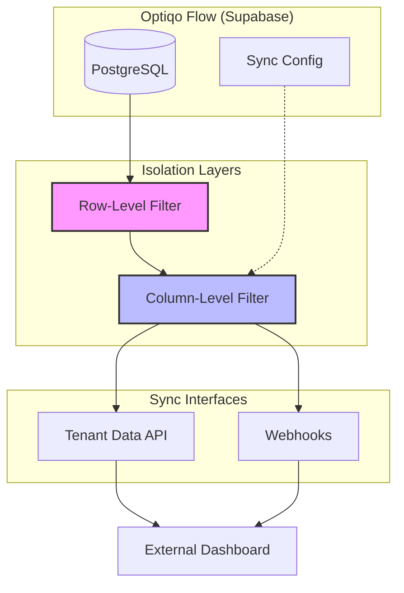

# OptiqoFlow Per-Tenant Data Isolation

This document outlines the architecture and mechanisms used to ensure per-tenant data isolation at both the row and column levels within the Optiqo platform.

## 1. Row-Level Isolation

Row-level isolation ensures that a tenant can only access data belonging to their organization. This is enforced through three primary filtering mechanisms depending on the data model.

### 1.1 Direct tenant_id Filter
Most operational and organizational tables include a mandatory `tenant_id` column.
- **Example Tables:** `rooms`, `sites`, `customers`, `contracts`, `schedules`.
- **Enforcement:** All queries must include a `.eq('tenant_id', tenantId)` clause.

### 1.2 Device-Based Junction Filter
IoT-related tables are linked to tenants via the `device_tenants` junction table, as a device may be owned by different tenants over time.
- **Example Tables:** `devices`, `device_measurements`, `device_configs`.
- **Enforcement:** The system first retrieves valid `device_id`s for the tenant where `is_current_owner` is true, then filters measurements by these IDs.

### 1.3 Parent Relation Filter
Child tables that inherently belong to a parent record inherit their isolation from that parent.
- **Example Tables:** `inspection_rooms` (belongs to `quality_inspections`), `quote_line_items` (belongs to `quotes`).
- **Enforcement:** The system filters child records by parent IDs that have already been validated for the requested `tenant_id`.

---

## 2. Column-Level Isolation

Column-level isolation restricts which specific data fields are shared with a tenant's external dashboard.

### 2.1 Per-Tenant Configuration
Administrators can configure a `columns_to_sync` JSON object per tenant.
- **Flexible Sync:** Allows choosing which non-essential business fields are exposed.
- **Null Default:** If not configured, the system defaults to predefined safe column lists.

### 2.2 Mandatory Fields
Certain columns are always included to ensure schema integrity on the subscriber end.
- **Always Included:** `id`, `created_at`, `updated_at`, and necessary foreign keys.

### 2.3 Strict Exclusions
Highly sensitive system fields are hard-coded to be excluded from all external sync payloads and API responses.
- **Example:** `psk_hash` (Pre-Shared Key) in the `devices` table is never exposed.

---

## 3. Sync Methods

### 3.1 Webhook (Push)
Optiqo pushes real-time changes to a unique, secret URL per tenant. Isolation is guaranteed by the URI endpoint itself and shared HMAC signatures.

### 3.2 Tenant Data API (Pull)
External systems pull data using an `X-API-Key`. The system maps the key to a specific `tenant_id` and automatically applies the row and column filters described above.

---

## 4. Architecture Diagram (Mermaid)

> [!TIP]
> This diagram is rendered using Mermaid, which doesn't require Graphviz/Dot to be installed.

